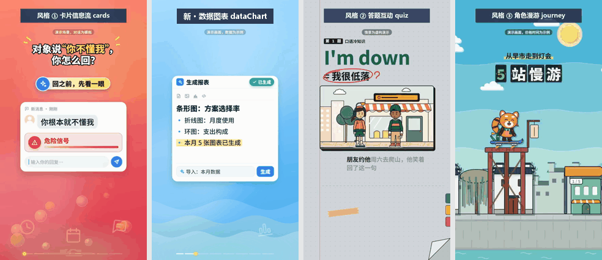
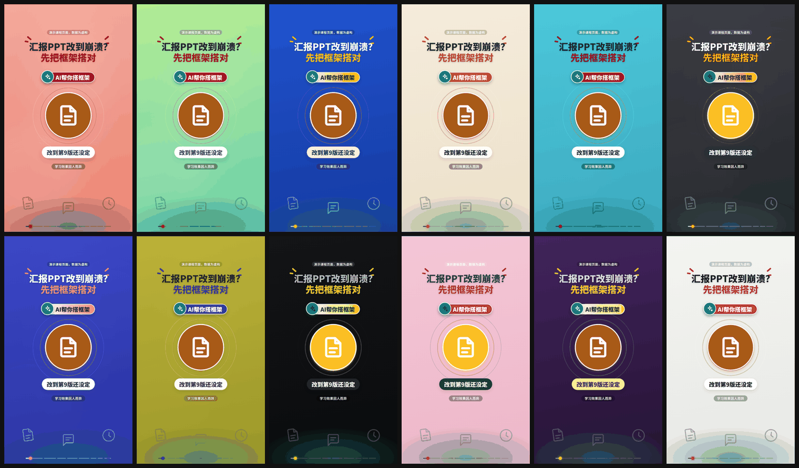
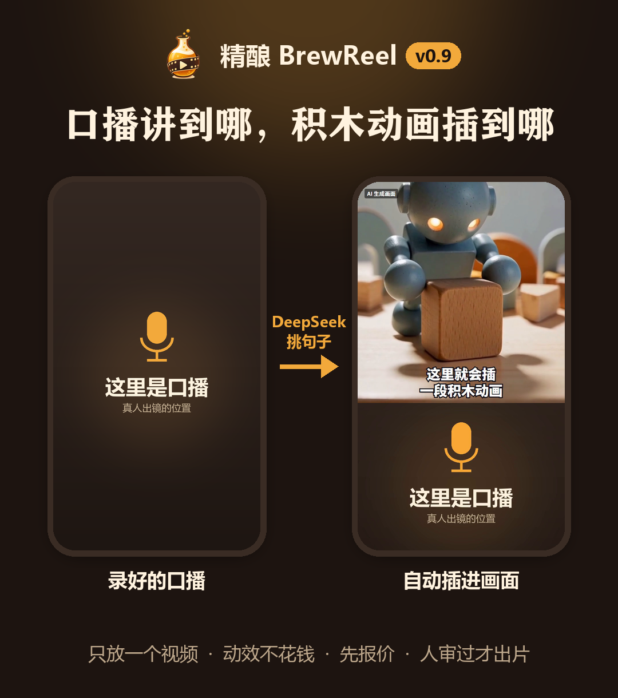
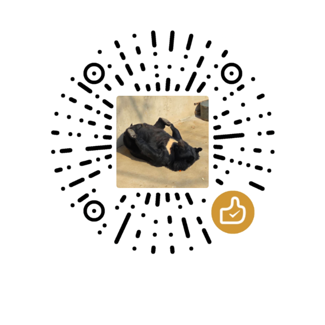

<div align="center">


# BrewReel · 精酿

**Two ways to make a video, each with one command.** Write a product brief and render a vertical promo, or drop in a talking-head clip and add pictures to the lines.

[](CHANGELOG.en.md)
[](https://github.com/Finderchangchang/brewreel/stargazers)
[](LICENSE)
[](#use-it-in-deepseek-harness)

[Promo videos](#promo-videos) · [Talking-head B-roll](#talking-head-b-roll) · [Style factory](#style-factory) · [Quick start](#quick-start) · [Docs](#docs) · [中文](README.md)

<table>
<tr>
<td width="50%" align="left">
<b>Promo video</b> (since v0.1)<br/>
<code>node scripts/make.mjs</code><br/>
<sub>Write a brief. A cheap model writes the storyboard.<br/>3 recipes · 6 industries</sub>
</td>
<td width="50%" align="left">
<b>Talking-head B-roll</b> (usable since v0.9)<br/>
<code>node scripts/talk.mjs</code><br/>
<sub>Drop in talk.mp4.<br/>Local transcription · motion cards or AI clips</sub>
</td>
</tr>
</table>

v0.10 also drafts an AI-picture style from one sentence. See [Style factory](#style-factory).

<sub>Formerly promo-video-skill / Distill Video (蒸馏视频); old links redirect automatically.</sub>

</div>

## Quick start

You need Node.js 18+ and Python 3.10+. On Windows, x64 only. The platform table, environment variables and the full write-up are in [Install and get started](docs/quickstart.en.md).

**1. Install dependencies.**

```bash
git clone https://github.com/Finderchangchang/brewreel.git
cd brewreel/template && npm install && npx remotion browser ensure
cd .. && pip install numpy scipy imageio-ffmpeg
```

**2. Promo video: render a sample.**

```bash
node scripts/validate.mjs examples/en-focus.json
node scripts/make.mjs examples/en-focus.json --out ../brewreel-out/en-focus
```

Rendering takes a few minutes. The last terminal line is `交付：<mp4 path>` ("delivered"). `--out` must not point inside the repo.

To have a model write the storyboard, put the repo at `~/.claude/skills/brewreel/` or `~/.agents/skills/brewreel/`, hand the assistant [`brief-template.md`](brief-template.md) (English templates are `industries/<id>/brief-template.en.md`) and let it follow `SKILL.md`. Without an assistant: `python scripts/llm_make.py path/to/brief.md`.

**3. Talking-head: one video file.**

Rename the talk to `talk.mp4` and put it in a project folder:

```bash
node scripts/talk.mjs path/to/project --out ../brewreel-out/talk
```

Transcription runs on your machine. DeepSeek writes `broll.json` (set `DEEPSEEK_API_KEY` or `LLM_API_KEY` first). Motion cards are drawn for real. AI clips start as stand-ins and cost nothing; a real render is estimated first, and a person approves it before the final video. See [Talking-head B-roll](docs/broll.en.md).

### Use it in DeepSeek Harness

The repo ships a plugin, `dsh-brewreel`, for validating, rendering and checking promo videos. It needs dsh 0.1.7-rc.2 or later within 0.1.x. The install command, the 7 tools and the license note are in [Install and get started](docs/quickstart.en.md#use-it-in-deepseek-harness). This version does not cover talking-head B-roll, and it has not been tested against a real DeepSeek model.

## Promo videos

Since v0.1: write a product brief, let a cheap model write one `storyboard.json` (it picks shots and fills in text, and it does not write code), and render a vertical video with one command.

<p align="center"></p>

| Recipe | When to use it |
|---|---|
| `cards` (default) | One selling point, a flow, a screen, a physical product or a price list. 9:16 |
| `quiz` | One multiple-choice question with a single right answer. 9:16 |
| `journey` | 4–6 categories to tour in order. 4:5 by default, 9:16 also works |

- **Six industries**: software, food, physical goods, adult vocational training, non-medical beauty, travel and lodging. Each pack has advertising-law and industry rules, a recommended shot structure and a brief template. Not supported: medical aesthetics, prescription drugs / medicine, K12 academic tutoring, dietary-supplement efficacy claims, tobacco.
- **Voice-over** (since v0.5): MiniMax, Alibaba Cloud or Volcengine. Shot lengths follow the narration, subtitles light up word by word, and the music ducks under speech.
- **Data charts** (v0.7): bar, line, dot, stacked and donut. Every number on the chart must appear in the cited fact. See [`docs/shots/dataChart.en.md`](docs/shots/dataChart.en.md).
- **Palettes** (v0.7): cards has 6 default themes and 12 optional ones. If you pick none, an old storyboard renders as before. See [`styles/cards/THEMES.md`](styles/cards/THEMES.md).
- **Music and captions**: `scripts/make_bgm.py` synthesizes the music on the spot, on the shot cuts. Captions can be Chinese or English.

<p align="center"></p>

A video with a ✗ in its self-check is not delivered. Details: [Features](docs/features.en.md). More frames: [Screenshots](docs/gallery.en.md).

## Talking-head B-roll

v0.8 was the experiment. Since v0.9 you can drop in one talk and render with one command. The project folder only needs `talk.mp4`.

<p align="center"></p>

<p align="center"><a href="https://github.com/Finderchangchang/brewreel/releases/download/v0.9.0/brewreel-v0.9.0-talk-demo.mp4">Watch the v0.9.0 demo</a></p>

- **Local transcription**: SenseVoice (FunAudioLLM / Alibaba Tongyi Lab), run with sherpa-onnx. An existing `talk.srt` is never overwritten.
- **Motion cards**: DeepSeek picks one per line. Five kinds: keyword, checklist, steps, counter, compare. The words must be copied from the speech, and the script checks them character by character. These cards do not cost money.
- **AI clips**: MiniMax H3. Three regular styles share one robot, described in `broll/character.json`: wood blocks (`wood-blocks`, the default; still called 积木风 in Chinese), clay stop-motion (`clay-stopmotion`) and layered paper (`paper-layers`). Ink sketch (`ink-sketch`) is experimental and only works as a stand-in preview. At most 2 AI clips by default.
- **Estimate first. A person approves the final video.** `--provider minimax-h3 --dry-run` only prints the estimate. Add `--yes` to generate. The person runs `node scripts/broll/approve.mjs <project> --out <dir-outside-the-repo>`. `talk.mjs` never runs it for you.

Price, placement and limits: [Talking-head B-roll](docs/broll.en.md). That page is still titled experimental: clay stop-motion and layered paper have not been generated for real, and ink sketch has no reference images yet.

## Style factory

v0.10. One sentence describes an AI-picture style. The script writes the config, generates reference images, scores them and makes one still. The vision check gets things wrong. A person looks last.

Print the requests first. This step calls nothing:

```bash
node scripts/broll/new-style.mjs --id demo-watercolor --name 水彩绘本 --desc "水彩晕染、纸纹、柔和暖色"
```

The sample name and description are the ones in the docs. `--name` and `--desc` are your own words. Add `--yes` when you want the real run. After `broll/styles/_drafts/<id>/review.html`, a person runs this in a terminal:

```bash
node scripts/broll/approve-style.mjs <id>
```

Only a person can run it. An AI assistant must not run it for you. A non-interactive terminal is refused. If a video test was made and it passed, the status is `stable`; otherwise it is `experimental`.

Pull requests that bring back an approved style are welcome. That is a different set of files from a promo-recipe remix, which still goes through [Contributing](CONTRIBUTING.en.md). Steps, cost and the vision rules: [Style factory](docs/style-factory.en.md).

## Why BrewReel

- **The cheap model only does what it is good at.** A promo writes `storyboard.json`. A talk writes `broll.json`. Pick shots, fill in text. No code, no coordinates.
- **A strong model tunes the recipe first.** Each promo style is written down as components and validation rules. The cheap model follows them.
- **Compliance red lines are checked first.** Every error says which shot and which field to fix. Validate → music → render → check frames runs as one command.
- **Open source, commercial use allowed.** Apache-2.0. Credit the source. Rendered videos do not require attribution.

## Docs

**Start**

- [Install and get started](docs/quickstart.en.md): platforms, setup, the cheap-model path, the talk command, the style factory, DeepSeek Harness
- [First video guide](https://brewreel.com/guides/first-promo-video.en.html) · [Product brief template](https://brewreel.com/guides/product-brief.en.html) (website)
- [Brief template](brief-template.md) (the general template in the repo)

**Two ways**

- [Features](docs/features.en.md): recipes, voice-over, industries, talking-head B-roll, style factory, validation
- [Screenshots](docs/gallery.en.md)
- [Talking-head B-roll](docs/broll.en.md)
- [Style factory](docs/style-factory.en.md)
- [How it works](docs/how-it-works.en.md)

**Reference**

- [FAQ](docs/faq.en.md)
- [Known limitations](docs/limitations.en.md)
- [Changelog](CHANGELOG.en.md) · [Releases](https://github.com/Finderchangchang/brewreel/releases) · [Contributing](CONTRIBUTING.en.md)

## Known limitations

- **Still a preview.** We do not recommend publishing a video as rendered, without a person editing it. Treat it as a first draft: watch it, edit, then publish.
- **Some integrations have not been run for real.** Alibaba Cloud and Volcengine voice-over have not been run with a real key. The DeepSeek Harness plugin has not been tested against a real DeepSeek model. MiniMax voice-over has been rendered with a real key.
- **Illustrations only, if you have no live photos.** Not supported: medical aesthetics, prescription drugs / medicine, K12 academic tutoring, dietary-supplement efficacy claims, tobacco.

The test method and the open problems are in [Known limitations](docs/limitations.en.md).

## Community / feature requests

**For contact, please send a private message to our WeChat Official Account.** Partnerships, sponsorship and feedback all go there. There is no dedicated BrewReel chat group yet.

<p align="center"></p>

**Bug reports go to [GitHub Issues](https://github.com/Finderchangchang/brewreel/issues)**: validation rules that block too much or too little, render errors, frames that look wrong. Attaching the storyboard JSON and the error output helps most (never paste an API key).

We want to hear real needs: what product do you want a video for? Which recipe or industry is missing? Which compliance rule got in your way? Message the Official Account or open an issue.

## Sister projects

Open-source projects by the same author, under the [jev-chat](https://github.com/jev-chat) organization:

- [Jev chat assistant (Jev 聊天助手)](https://github.com/jev-chat/jev-chat-jarvis): a "conversation co-pilot" on your phone. In supported chat apps it helps you read the other person, suggests replies and fills them into the input box; whether to send is up to you.
- [Jev chat assistant for macOS](https://github.com/jev-chat/jev-chat-jarvis-mac): a floating window that reads WeChat message intent: it looks at the screen, a local small model judges intent and risk, then it drafts reply candidates. Read-only.
- [Jev chat assistant for Windows](https://github.com/jev-chat/jev-chat-windows): a reply helper that sits beside WeChat for Windows 4.x: window screenshot + local offline OCR, 3 candidates filled in with one click, and sending is always manual.

## Copyright and license

Copyright © 2026 Finderchangchang. The code is released under the [Apache-2.0](LICENSE) license; see also [NOTICE](NOTICE) and [THIRD_PARTY_LICENSES.md](THIRD_PARTY_LICENSES.md).

- **Commercial use is allowed**: individuals and companies may use, modify and redistribute it, or build it into their own products, with no fee and no prior permission.
- **Credit the source**: under Section 4 of Apache-2.0, if you distribute this project, a modified version, or a product that includes it, keep `LICENSE` and carry the attribution in `NOTICE` in your own NOTICE file, documentation or product UI. Suggested wording: `Based on BrewReel (精酿, https://github.com/Finderchangchang/brewreel)`.
- Don't use the names "BrewReel" or "精酿" or the brewreel.com domain to imply that your work is made or endorsed by the original author.
- **Videos rendered with this project do not require attribution.**
- **Remotion is not open source**: for-profit organizations with 4 or more people must purchase Remotion's Company License, and this repo's Apache-2.0 license doesn't change that; see <https://www.remotion.dev/license>.
- The fonts Noto Sans SC and Cascadia Mono are licensed under the SIL Open Font License 1.1; the full license text ships alongside each font under `template/public/fonts/`.

**Scope of use**: the rules in `industries/` and the validation scripts are compiled from public regulations and platform rules for self-checking only. They **are not legal advice** and are not guaranteed to cover every platform's latest rules. Whether published content is compliant is governed by the latest rules from regulators and platforms at the time; the publisher is solely responsible.

## ❤️ Sponsors

> Want to appear here? Add me on WeChat: **jskjkf007**, and include the note "BrewReel 商务合作" (BrewReel business) in your request.

## ☕ Buy me a coffee

If BrewReel saved you an evening of video editing, feel free to buy me a coffee. Every recipe here was brewed on a lot of coffee: keep the cup filled and the next recipe comes sooner. If a new style suddenly shows up in the repo one day, this cup probably helped 😄

<p align="center">
  
</p>

<p align="center"><sub>Only if it's easy for you, no pressure. A Star, an issue, or showing me a video you brewed makes me just as happy.</sub></p>

## Acknowledgements

- The talking-head B-roll idea comes from [erduo1998-cell/vidmuse-video-creator](https://github.com/erduo1998-cell/vidmuse-video-creator): our way of reading the captions and picking lines for explainer shots is a rewrite of its method.
- Local transcription uses [SenseVoice](https://github.com/FunAudioLLM/SenseVoice) (FunAudioLLM / Alibaba Tongyi Lab), run with [sherpa-onnx](https://github.com/k2-fsa/sherpa-onnx).
- Videos are composed with [Remotion](https://www.remotion.dev/).
- Licenses: [THIRD_PARTY_LICENSES.md](THIRD_PARTY_LICENSES.md).
