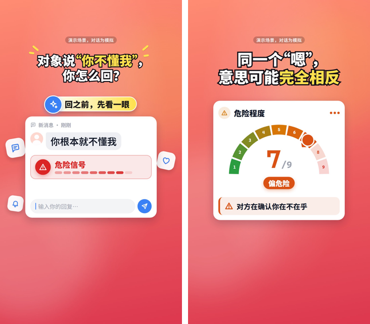

# promo-video-skill

[中文版 → README.md](README.md)

Author: **Liu Weijie (柳伟杰)** — GitHub [@Finderchangchang](https://github.com/Finderchangchang). If you redistribute, fork or use this commercially, please keep `LICENSE` and `NOTICE` and credit the source.

> **Early preview**: testing and bug-fixing are still ongoing. Issues about false-positive rules, rendering problems and general feedback are very welcome.

One line: a skill for AI coding assistants (Claude Code / Codex / opencode…) that standardizes "write a storyboard → get a vertical promo video." A cheap model only writes one `storyboard.json`; fixed Remotion components draw the frames; a validator blocks hard rules and industry-compliance red lines; one command renders the final video (1080×1920, with original music and sound effects).

## 30-second overview

1. You (or the AI) turn a merchant brief into `storyboard.json` (pick shots, fill in text — no code, no coordinates).
2. `node scripts/validate.mjs storyboard.json` validates it: hard rules and ad-law / industry compliance red lines are caught with a report you can act on.
3. `node scripts/make.mjs storyboard.json --out <dir>` renders in one command: music → render → contact sheet → check frames, fully automated.

## Examples

| Software (Jev chat-assistant sample) | Food & beverage (Guangfu Coffee sample) |
| --- | --- |
|  |  |

Storyboard samples for the other industries (ecommerce, education, beauty, travel) are already in `examples/`; preview images for them are still being filled in — see "Known gaps" below, an expected gap in this early preview.

## What it does and doesn't do

**Does**: vertical promo videos for six industries — software products, food & beverage, physical-goods ecommerce, adult vocational education, beauty (non-medical), and travel/lodging; Chinese or English captions; 11 general-purpose shots plus 7 industry shots (real photo, price card, store card, review card, before/after, fact sheet, credential card); dozens of built-in checks covering ad-law superlatives, industry compliance red lines, line-wrap/orphan-word issues, and safe-area layout.

**Does not** (these categories aren't covered by the compliance rules, so results aren't guaranteed compliant even if you force them):
- Medical aesthetics, prescription drugs/medicine, K12 academic tutoring, dietary-supplement efficacy claims, tobacco
- Generating images that look like "real photography" of a product — when there's no real material, the video falls back to simple line-drawn illustrations and labels them clearly, rather than pretending to be a real photo

## Supported industries and languages

| `meta.industry` | Description |
| --- | --- |
| `software` (default) | Apps, SaaS, tools |
| `food` | Restaurants, single-item launches |
| `ecommerce` | Physical goods |
| `education` | Adult vocational training (not K12) |
| `beauty` | Non-medical beauty services |
| `travel` | Tourism, lodging, homestays |

`meta.lang`: `zh` (default, Chinese captions) / `en` (English captions).

## Installation

### Requirements

| Item | Requirement |
| --- | --- |
| Node.js | ≥ 18 (20 LTS or newer recommended; this repo is tested on Node 22) |
| Python | 3.10+ (for the music-generation script; needs `numpy`/`scipy`) |
| OS | Windows (x64 only) / macOS ≥ 15 / Linux (glibc ≥ 2.35, plus shared libs like `libnss3`/`libgbm`/`libasound2`; Alpine and nixOS are not supported) |

### Three commands

```bash
git clone https://github.com/Finderchangchang/promo-video-skill.git
cd promo-video-skill/template && npm install && npx remotion browser ensure
cd .. && node scripts/validate.mjs examples/en-focus.json
```

The first command installs the rendering-engine dependencies (including Remotion compositor packages for 7 platforms — optional, but kept in the lockfile so switching platforms just works); the second additionally downloads a Chrome Headless Shell (~110MB, used for headless rendering); the third validates one of the bundled example storyboards — if it passes, your setup is good.

You can also install it as a skill for your AI coding assistant (if it has a skill manager): manually clone the whole repo into `~/.claude/skills/promo-video-skill/` (Claude Code) or `~/.agents/skills/promo-video-skill/` (a common convention), or point your tool's own skill-install command at this repository's URL.

## Workflow

```
Brief
  → storyboard.json (pick shots, fill in text)
  → node scripts/validate.mjs (hard rules + industry compliance; the report tells you what to fix)
  → node scripts/make.mjs (music → render → contact sheet → check frames)
  → pre-publish human checklist (see "Pre-publish checklist" in SKILL.md)
```

For the full workflow and every field's meaning, see `SKILL.md` (this is what the AI assistant reads to write a storyboard). `shots.en.md` is the parameter reference for all 18 shots; `docs/shots/*.en.md` has one detailed doc per shot.

## Running it with a cheap model (DeepSeek example)

`scripts/llm_make.py` is a headless script that doesn't need an agent loop — it calls an OpenAI-compatible endpoint directly: brief in, video out, with validator errors automatically fed back to the model on retry.

```bash
export ANTHROPIC_BASE_URL=https://api.deepseek.com/anthropic   # only needed if wiring DeepSeek into Claude Code
export ANTHROPIC_AUTH_TOKEN=<your DeepSeek API key>
export ANTHROPIC_MODEL=deepseek-flash[1m]

# or call the headless script directly, without going through Claude Code:
export LLM_API_KEY=<your DeepSeek API key>
export LLM_BASE_URL=https://api.deepseek.com
export LLM_MODEL=deepseek-chat
python scripts/llm_make.py path/to/brief.md
```

On Windows PowerShell use `$env:LLM_API_KEY="..."` instead of `export`. All of the values above are placeholders — swap in your own key, and never commit a key or paste one into an issue. You may also put these variables into your AI assistant's own global config (e.g. `~/.claude/settings.json`) — that's an optional convenience this repo mentions but never does for you.

## Industry packs: adding a new industry

Each industry lives under `industries/<id>/`:

```
industries/<id>/
  rules.json             Compliance rules (enabledShots, checks, mediaPolicy, etc.), merged with industries/_base/rules.json
  recipe.md               Recommended shot structure and writing notes (required reading before writing a storyboard)
  recipe.en.md             English version
  brief-template.md        The brief template to hand to a merchant
  brief-template.en.md      English version
  test-brief.md             One full sample brief
  expected.md                Which rules that sample brief should trigger (used for regression tests)
```

To add an industry: copy an existing industry folder and rename it, fill in `rules.json` following the field documentation in `industries/_base/rules.json`, write `recipe.md` describing which shots this industry should use and its common compliance pitfalls, then write a `test-brief.md` + `expected.md` and run `node scripts/test-rules.mjs` to confirm the rules actually fire.

## Validation rules and disclaimer

The rules in `scripts/validate.mjs` are compiled from publicly available advertising-law superlative-word lists and public platform rules, in three tiers:
- **error (block)**: must be fixed, or `make.mjs` refuses to render
- **warning (warn)**: recommended to fix, not enforced
- **human review**: things a machine can't judge (e.g. "is this photo actually authorized", "is this review genuine") — listed as a checklist for the publisher to confirm after rendering

**These rules are for self-checking only, are not legal advice, and are not guaranteed to cover every platform's latest rules.** Whether published content is compliant is governed by the latest rules from regulators and platforms at the time; the publisher is solely responsible. Known rule edge cases and unverified items are tracked in this project's internal dev notes (not shipped in this repo) — please file an issue with any false positive or missed case you hit in practice.

## Testing status / known limitations

This is an early preview. It has been tested by generating storyboards in bulk with a cheap model (DeepSeek-class) across all six industries plus English, then scoring the results by hand and fixing issues in priority order over several rounds. **Current average quality**: the hard, machine-checked rules (the errors/warnings `validate.mjs` catches) are fairly reliable by now, but **content quality** — whether the copy actually fits the product, whether numbers are invented, whether the video is visually engaging — still depends on how well the underlying model does on a given run. A human pass before publishing is still necessary; passing validation is not a green light to publish unreviewed.

Known gaps (as currently understood; issues with concrete counter-examples are welcome):

- **English videos can still show a stray Chinese string.** The renderer scans the actual on-screen text and flags any Han character when `meta.lang` is `"en"`, but this currently covers only the most commonly used shot components — a handful of less-common components still have hard-coded Chinese strings without an English variant, so a leak is still possible in principle.
- **Numeric claims aren't fully verified.** Amounts, durations and scores get a basic cross-check against `meta.facts`, but colloquial phrasing (like "in seconds", "instantly") and qualifiers attached to a number (a date range, whether it's a post-coupon price, a count) aren't cross-checked yet, so a model-invented number can still slip through.
- **The `compare` shot's direction/score is model-written content.** The validator only checks that a basis is stated, not whether the higher-scoring side actually makes sense — we've seen a generated storyboard pass validation with the comparison direction reversed.
- **Asset-truth checks are incomplete.** Obvious placeholder stubs (<1KB) and `_dev/`-path assets are caught, but a content-level issue like the same photo being used for both "before" and "after" is not.
- **Bottom third of the frame is often bare background** in many shots — visual density there is a known gap for a future pass, not something the validator enforces.
- **Template feel**: different products in the same industry sometimes converge on a similar cover composition (e.g. the same icon-ring layout); there's no diversity enforcement yet.
- **`make.mjs` currently reports layout issues without blocking the render.** A `✗` line under "layout self-check" in `report.txt` means that render has clipped/overlapping/out-of-bounds text — it's a signal for a human to judge whether to re-render, not an automatic gate.
- All 9 bundled `examples/*.json` storyboards pass validation (0 errors), but only 2 of them (software, food) have been rendered end-to-end with a preview image so far; preview images for the rest are still being filled in.

## Directory structure

```
promo-video-skill/
  SKILL.md / SKILL.en.md      The instructions an AI assistant reads (how to pick shots, fill fields, follow the flow)
  README.md / README.en.md    This file
  LICENSE / NOTICE / THIRD_PARTY_LICENSES.md
  shots.md / shots.en.md      Parameter reference for all 18 shots
  brief-template.md           Generic brief template
  docs/
    shots/                    Detailed per-shot docs (18 shots × 2 languages)
    images/                   Example preview images used in the READMEs
  industries/                 The six industry packs (see above)
  scripts/
    validate.mjs              Validation entry point
    make.mjs                  One-command render
    llm_make.py                Headless mode: brief → storyboard → video
    make_bgm.py                  Parametric original background music
    build_docs.mjs                Generates shots.md / shots.en.md from spec.json files
    privacy-scan.mjs              Pre-publish privacy self-check
    checks/ lib/                   Rule implementations
  template/                   The Remotion rendering project
    src/shots/                 18 shot components + parameter specs
    src/core/                  Fonts, themes, animation, layout helpers
    src/illust/                Industry fallback illustrations
    public/                    Fonts, sound effects, sample assets
  examples/                   9 ready-to-render storyboard samples (six industries + English + two generic samples)
  tests/
    validate/                  Positive/negative regression tests for the validator
    rules/                     Regression tests for each industry's rules (4 cases each)
```

## FAQ

**What should I watch for when Remotion 5.0 ships?**
This repo pins `remotion` / `@remotion/cli` to `4.0.529`. After upgrading to 5.0, Remotion's free tier requires passing a `licenseKey` in config (individuals / companies with ≤3 people / non-profits use `"free-license"`) — see the [Remotion license page](https://www.remotion.dev/license). Read `THIRD_PARTY_LICENSES.md` before upgrading.

**A platform's compositor package is missing from the lockfile after `npm install`?**
`package-lock.json` should contain 7 `@remotion/compositor-*` platform packages (win32-x64-msvc / darwin-arm64 / darwin-x64 / linux-x64-gnu / linux-x64-musl / linux-arm64-gnu / linux-arm64-musl). If the one for your platform is missing, delete `template/node_modules` and `template/package-lock.json` and re-run `npm install` on the target platform (this is a known npm optional-dependency resolution quirk — a lockfile generated on one platform doesn't always include every platform).

**Chrome Headless Shell fails to download?**
`npx remotion browser ensure` may not be able to reach Google's download endpoint from some networks. Download it manually and point to a local Chrome/Chromium install with `--browser-executable` (rendering results may differ slightly between Chrome versions).

**`--props` fails with "neither valid JSON" on Windows?**
The Windows shell mangles quotes inside JSON strings, so storyboards are always passed as a file path (`--props=./storyboard.json`), never as an inline JSON string on the command line. `make.mjs`/`llm_make.py` already do this the file-path way.

**`sheet.png` (the contact-sheet mosaic) isn't generated?**
Remotion's bundled, slimmed-down ffmpeg doesn't compile the `tile`/`pad` filters — it's only meant for audio/video encoding, not compositing. Install a full system ffmpeg (from ffmpeg.org or your OS package manager), set the `FFMPEG=/path/to/ffmpeg` environment variable, and re-run; this doesn't affect the final `video.mp4` or the `check/*.png` review frames.

## License

This repository's code is released under the **Apache-2.0** license — see `LICENSE`. Copyright holder: Liu Weijie (柳伟杰, Finderchangchang). **Commercial use is free.** Under Section 4 of Apache-2.0, if you redistribute this code, a modified version, or a product that includes it, you must keep `LICENSE` and carry the attribution in `NOTICE` (i.e. credit "promo-video-skill by Liu Weijie") in your own NOTICE file, documentation or product UI. Videos rendered with this tool do not require attribution.

This repo depends on [Remotion](https://www.remotion.dev) as its rendering engine. Remotion is **source-available, not open source**: free for individuals, for-profit companies with 3 or fewer people, and non-profits (including commercial use); **for-profit organizations with 4 or more people must purchase Remotion's Company License** — see <https://www.remotion.dev/license>. This repo's Apache-2.0 license does not change Remotion's own license terms; details in `THIRD_PARTY_LICENSES.md`.

The fonts Noto Sans SC and Cascadia Mono are licensed under the SIL Open Font License 1.1; the full license text ships alongside each font under `template/public/fonts/`.

Videos rendered with this project do not require attribution back to this project.
