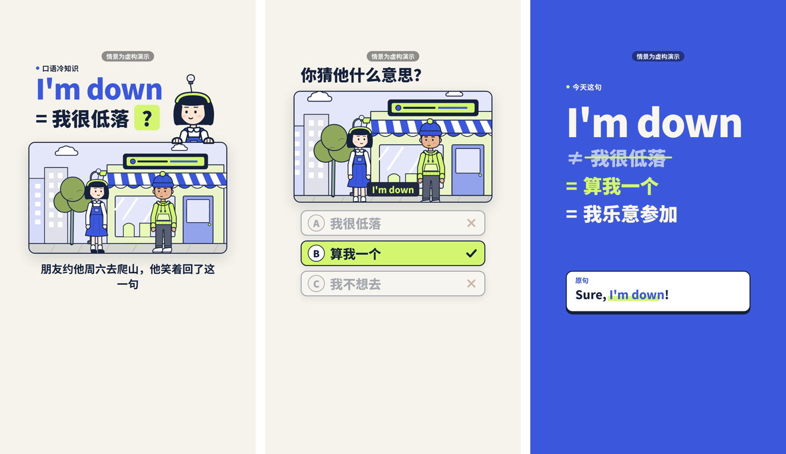
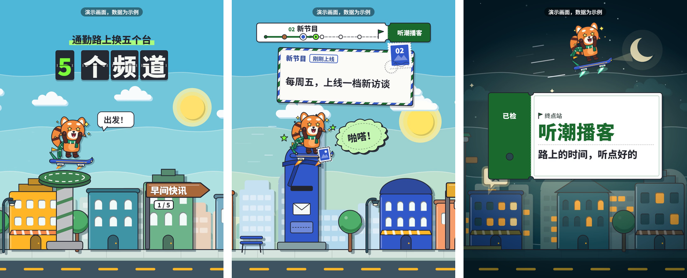

<div align="center">


# 精酿 · BrewReel

**便宜模型，也能酿出好片：写一份产品简报，AI 挑镜头、写文案，一条命令出一支竖版宣传片。**

[](https://github.com/Finderchangchang/brewreel/stargazers)
[](https://github.com/Finderchangchang/brewreel/forks)
[](CHANGELOG.md)
[](#在-deepseek-harness-里用)
[](https://www.remotion.dev)
[](LICENSE)

[官网](https://brewreel.com) · [演示视频](https://github.com/Finderchangchang/brewreel/releases/download/v0.3.0/demo-5MB.mp4) · [历史版本](https://github.com/Finderchangchang/brewreel/releases) · [更新日志](CHANGELOG.md) · [在 DeepSeek Harness 里用](#在-deepseek-harness-里用) · [姊妹项目 Jev 聊天助手](https://github.com/jev-chat/jev-chat-jarvis) · [English](README.en.md)

<sub>原名 promo-video-skill / 蒸馏视频，旧地址自动跳转。</sub>

</div>

## ❤️赞助商

> 想出现在这里？加微信 **jskjkf007**，添加时请备注「BrewReel 商务合作」。

## 截图

下面都是实际渲染的画面。分镜都在仓库里，产品和数据都是虚构的；[演示视频](https://github.com/Finderchangchang/brewreel/releases/download/v0.3.0/demo-5MB.mp4)（v0.3.0 附件，约 5 MB）是三种配方的实际渲染效果。

**三种配方**

<table align="center">
<tr><td align="center"><br/><sub><b>cards 卡片信息流</b>（默认，9:16）：渐变底 + 居中白卡片 + 描边大字幕，一镜讲一件事</sub></td></tr>
<tr><td align="center"><br/><sub><b>quiz 答题互动</b>（9:16）：红笔圈出一个常见误解 → 出一道选择题 → 揭晓 → 词条卡讲清楚</sub></td></tr>
<tr><td align="center"><br/><sub><b>journey 角色漫游</b>（4:5 / 9:16）：原创吉祥物一镜到底横穿剪纸城市，每站一张明信片讲一个类别</sub></td></tr>
</table>

**六个行业**（每张图左边是第 0 帧封面，右边是片中一帧）

<table align="center">
<tr>
<td align="center"><br/><sub>软件 · 记账工具（ledger）</sub></td>
<td align="center"><br/><sub>餐饮 · 单品上新（food）</sub></td>
<td align="center"><br/><sub>电商 · 实物商品（ecommerce）</sub></td>
</tr>
<tr>
<td align="center"><br/><sub>教培 · 成人职业课程（education）</sub></td>
<td align="center"><br/><sub>美业 · 无实拍照片（beauty）</sub></td>
<td align="center"><br/><sub>文旅 · 住宿（travel）</sub></td>
</tr>
</table>

<details>
<summary>更多样例：情感聊天 App、会议纪要、英文字幕</summary>

<table align="center">
<tr>
<td align="center"><br/><sub>软件 · 情感聊天（jev）</sub></td>
<td align="center"><br/><sub>软件 · 会议纪要（meeting）</sub></td>
<td align="center"><br/><sub>英文字幕（en-focus）</sub></td>
</tr>
</table>

</details>

这 9 份分镜在 `examples/`（都是 cards 配方），quiz 和 journey 的样例在 `styles/quiz/examples/`、`styles/journey/examples/`。每份都能直接通过校验并用 `make.mjs` 出片。

## 为什么用它

- **便宜模型只做它做得好的事。** 模型只写一份 `storyboard.json`：挑镜头、填文字，不写代码、不算坐标。版式、动效、节奏都在现成组件里。
- **配方由强模型先调好。** 每种风格先由强模型做到位，再写成组件和校验规则；便宜模型照着填，出片水准由配方兜底。
- **合规红线先拦一遍。** 内置《广告法》极限词、六个行业的合规规则、断词换行、安全区等几十条校验，报错用中文写清楚哪里要改。
- **一条命令出片。** 校验 → 配乐 → 渲染 → 拼图 → 检查帧，全自动；自查有 ✗ 的片子不交付。
- **配乐现场合成，没有版权问题。** 按镜头切点卡拍，响度统一到 -16 LUFS。
- **中英双语。** 字幕可选中文或英文；英文片每半拍扫一次画面，混进汉字就不交付。
- **开源、可商用。** Apache-2.0，注明出处即可；渲染出的视频不要求署名。

## 平台支持

| 用法 | 状态 | 说明 |
|---|---|---|
| Claude Code / Codex / opencode 等能读 `SKILL.md` 的 AI 编程助手 | ✅ 可用 | 把仓库装成 skill，助手照 `SKILL.md` 写分镜、跑校验、出片 |
| DeepSeek Harness 插件 `dsh-brewreel` | ⚠️ 已发布到 npm | 7 个工具负责校验、出片、核对；还没接真实 DeepSeek 模型实测 |
| 无 agent 脚本 `scripts/llm_make.py` | ✅ 可用 | 直接调 OpenAI 兼容接口（默认 DeepSeek），简报进、视频出，校验报错自动回喂重试 |

| 运行环境 | 要求 |
|---|---|
| 操作系统 | Windows（仅 x64）/ macOS ≥ 15 / Linux（glibc ≥ 2.35，需要 `libnss3` / `libgbm` / `libasound2` 等共享库；不支持 Alpine、NixOS） |
| Node.js | ≥ 18（建议 20 LTS 或更高，本仓库在 Node 22 上测试过）；DeepSeek Harness 插件要 22.19+ 的 22.x 或 24+ |
| Python | 3.10+；配乐脚本要 `numpy` / `scipy`，`llm_make.py` 只用标准库 |
| 首次下载 | 渲染依赖约几百 MB，外加约 110 MB 的 Chrome Headless Shell |

成片 1080×1920（journey 默认 1080×1350），30 fps，带配乐和音效。

## 快速开始

**1. 装依赖。**

```bash
git clone https://github.com/Finderchangchang/brewreel.git
cd brewreel/template && npm install && npx remotion browser ensure
cd .. && pip install numpy scipy
```

`npm install` 装渲染引擎（lock 文件里带 7 个平台的 Remotion compositor，换平台不用重新生成）；`npx remotion browser ensure` 下载一次 Chrome Headless Shell，供无头渲染用。

**2. 跑一个样例，确认装好了。**

```bash
node scripts/validate.mjs examples/ledger.json
node scripts/make.mjs examples/ledger.json --out ../brewreel-out/ledger
```

第一条校验通过就说明装好了。第二条出片要几分钟，终端最后一行是「交付：<mp4 路径>」；输出目录里有 `video.mp4`、拼图 `sheet.png`、检查帧 `check/`、`report.txt` 和交付清单 `manifest.json`。`--out` 不能指向仓库里面。

**3. 让 AI 写分镜。** 三选一：

- **装成 skill**：把整个仓库 clone 到 `~/.claude/skills/brewreel/`（Claude Code）或 `~/.agents/skills/brewreel/`（通用约定），或用你工具自带的 skill 安装命令指向本仓库。然后把简报交给助手（模板见 [`brief-template.md`](brief-template.md)），让它照 `SKILL.md` 出片。
- **无头脚本**：不需要 agent，见下面的[「用便宜模型直接跑」](#用便宜模型直接跑)。
- **DeepSeek Harness**：装插件后模型用工具校验和出片，见[「在 DeepSeek Harness 里用」](#在-deepseek-harness-里用)。

### 用便宜模型直接跑

`scripts/llm_make.py` 直接调 OpenAI 兼容接口：简报进、视频出，校验报错会原样回喂给模型重试（最多 3 次）。

```bash
export ANTHROPIC_BASE_URL=https://api.deepseek.com/anthropic   # 仅当把 DeepSeek 接到 Claude Code 时需要
export ANTHROPIC_AUTH_TOKEN=<你的 DeepSeek API Key>
export ANTHROPIC_MODEL=deepseek-flash[1m]

# 或者直接用无头脚本，不接 Claude Code：
export LLM_API_KEY=<你的 DeepSeek API Key>
export LLM_BASE_URL=https://api.deepseek.com
export LLM_MODEL=deepseek-chat
python scripts/llm_make.py path/to/brief.md
```

Windows PowerShell 用 `$env:LLM_API_KEY="..."` 代替 `export`。以上都是占位符，换成你自己的 key；不要把 key 提交进仓库或写进 issue。也可以把这些变量写进 AI 编程助手自己的全局配置（如 `~/.claude/settings.json`），这是可选做法，本仓库不会替你改任何全局配置。加 `--dry-run` 不调接口、不读密钥，只把拼好的提示写出来并估算 token 数。

### 在 DeepSeek Harness 里用

仓库自带一个 DeepSeek Harness（dsh）插件，放在 [`integrations/deepseek-harness/`](integrations/deepseek-harness/README.md)，包名 `dsh-brewreel`（原名 `dsh-distill-video`，从旧版升级见插件 README 的「从 dsh-distill-video 升级」）。装上后，模型照着 skill 写分镜，校验、出片、核对都调插件的工具完成，不用自己拼 `node scripts/…` 命令；出片在后台跑、报进度，输出路径和子进程拿到的环境变量都受插件限制。

需要 **dsh 0.1.7-rc.2 或更高**的 0.1.x。npm 上 dsh 的 `latest` 标签目前还指向更早的 0.1.5-rc.3，所以安装时要写明版本号。另外要有 Node.js 22.19+ 的 22.x 或 24+，以及 pnpm（`dsh plugin` 靠 pnpm 装插件）。从 npm 安装：

```bash
npm install -g @deepseek-ai/dsh@0.1.7-rc.2 pnpm    # 还没装 dsh 时
dsh plugin --profile web add dsh-brewreel
dsh web
```

`web` 可以换成你自己的 profile 名，profile 已经在运行的要重启才生效。第一次用时对模型说「检查一下视频插件环境」，它会调 doctor，经你同意后再调 setup 装渲染依赖（约几百 MB，外加约 110 MB 的 Chrome Headless Shell）。想用仓库里还没发版的代码，可以 clone 后在上一级目录执行 `dsh plugin --profile web add ./brewreel/integrations/deepseek-harness`。插件还没接真实 DeepSeek 模型实测，遇到问题请开 issue。

<details>
<summary><b>7 个工具、许可提醒与安全说明</b></summary>

- `brewreel_doctor` 查环境，`brewreel_setup` 装依赖和浏览器，`brewreel_catalog` 列风格、行业和配色，`brewreel_guide` 读 skill 与各风格、行业、镜头文档，`brewreel_validate` 校验分镜并给改法，`brewreel_render` 后台出片，`brewreel_verify` 核对成片是否还对应当前分镜。
- 许可提醒：插件和 skill 是 Apache-2.0，但渲染引擎 Remotion 不是开源软件，**4 人及以上的营利组织需要购买 Remotion 的 Company License**（见[「版权与许可」](#版权与许可)和 `THIRD_PARTY_LICENSES.md`）；插件不改变这一点。
- 渲染子进程不经过 dsh 的 shell 沙箱，以当前用户权限运行。
- 配置项、安全说明和故障排查见插件的 [README](integrations/deepseek-harness/README.md)。

</details>

## 功能

### 三种配方

分镜里写 `meta.style` 选配方，不写就是默认的 `cards`。每种配方是一个「风格包」：自带设计令牌、镜头组件、校验规则和叙事模板，文档、规则、样例放在 `styles/<id>/`，代码放在 `template/src/styles/<id>/`。

| 配方 | 画幅 | 适合 |
|---|---|---|
| `cards` 卡片信息流（默认） | 9:16 | 单一卖点、使用流程、界面演示、实物和门店、价目表 |
| `quiz` 答题互动 | 9:16 | 有一个常见误解、能出一道唯一正确答案的选择题（「X 到底是什么意思？」） |
| `journey` 角色漫游 | 4:5（默认）/ 9:16 | 有 4–6 个清楚的类别、功能或站点，想按一条路线挨站逛一遍 |

怎么选：能出一道选择题 → `quiz`；有 4–6 个类别想挨站逛 → `journey`；其余情况 → `cards`，也就是不写。`quiz` 只接受 9:16，它的专属镜头（出题、揭晓、释义卡等）只能在 `quiz` 里用，和 `cards` 的 18 个镜头不混用，写错会被校验拦下。

```json
{ "meta": { "style": "quiz", "industry": "software", "lang": "zh" }, "shots": [ ... ] }
```

<details>
<summary><b>每种配方长什么样</b></summary>

**`cards` 卡片信息流**（默认，可用，9:16）：渐变底 + 居中白卡片 + 描边大字幕，一镜讲一件事。适合单一卖点、讲使用流程、演示界面、实物和门店。18 个镜头、六个行业的样例都在 `examples/`。

**`quiz` 答题互动**（可用，9:16）：皮肤是「批改纸」——点阵答题纸底加一条朱红页边线，深色主色 + 杏黄马克笔 + 朱红批改笔，标签用等宽字，卡片是小圆角 + 实色硬投影；三套配色（`sage-pine` 灰绿纸 + 松绿，默认；`rice-soy` 米纸 + 酱色，餐饮默认；`ash-teal` 灰纸 + 深青），三套口吻（`phraseTitle.params.voice`：`exam` 考场腔 / `chat` 闲聊腔 / `show` 挑战腔）。两个原创角色一矮一高：戴耳机的主讲人（懂了耳罩亮起、发出声波）和反戴棒球帽的搭档。节奏是「红笔圈出一个常见误解 → 答题卡出一道 A/B/C 题、秒表倒数 3 → 揭晓打勾 → 词条卡翻正（误解被波浪线划掉 + 编号释义）→ 回放原片段、盖一枚「懂了」章 → 小剧场演一遍 → 评论区互动 → 印章擦除落到结业卡」。适合有常见误解、能出一道选择题的产品：一句外语的真正意思、软件里一个常被误会的功能（如「归档 = 删掉了？」）、一道菜为什么要这么做。说明见 [`styles/quiz/`](styles/quiz/README.md)，写法和字数见 `styles/quiz/recipes.md`，5 份样例分镜在 `styles/quiz/examples/`。

**`journey` 角色漫游**（可用，默认 4:5，也支持 9:16）：皮肤是「旅行文具」+「剪纸分层」——原创吉祥物「橘团」踩悬浮滑板，一镜到底横穿一座剪纸风城市（远、中、近景和角色各是一张纸，身后投硬边纸影）；开场是车站翻牌大字，顶部一整条车票标着路线、站点和当前站名，每站甩进来一张航空信封边的明信片写代表内容、看完「寄出」到车票上这一站；配色是邮政绿 + 荧光青柠 + 石墨描边（`post-green`，另有 `plum-ticket` 酒红车票）。背景三选一（现代城市 / 低层街巷 / 古城的白墙黛瓦和石桥河道），14 种街区按内容挑（道口、邮筒、检票口、大头贴、搭车站、夜站台、手机、住家、咖啡、集市、城门、石桥、茶馆、灯会），每站一个车站 / 邮路题材的小笑点，天色从白天走到夜晚；到终点，顶部那张车票滑到画面中间展开，检票钳在票根上打个孔，车票翻面露出产品名和口号；最多一个数字，印在正面终点旗旁。适合内容多、类别清楚的产品：内容平台的栏目、软件的功能、一条游线的景点。说明见 [`styles/journey/`](styles/journey/README.md)，写法和字数见 `styles/journey/recipes.md`，3 份样例分镜在 `styles/journey/examples/`。

</details>

### 配音（MiniMax）

分镜里写 `meta.voice`、每镜写一句 `vo`（旁白），出片时就带配音；不写就是无配音片，和以前一样。

- **声音就是时间轴**：`make.mjs` 先用 MiniMax 语音合成念出每句旁白、拿到逐字时间，再把有旁白的镜头时长改成「0.15 秒 + 旁白 + 0.35 秒」并对齐到拍，便宜模型不用自己算时长。
- **逐字字幕**：字幕跟着声音一个字一个字点亮，三种配方都支持；也可以选整句出现（`line`）或不出旁白字幕（`off`）。cards 里有 `vo`、没写 `caption` 的镜头，字幕由旁白自动生成。
- **配乐自动让路**：人声处背景音乐压低约 10 dB，说完再回来。
- **缓存省钱**：同一句（音色、语速、情绪、文字都一样）只合成一次，缓存在用户目录 `~/.cache/brewreel/tts`（环境变量 `BREWREEL_TTS_CACHE` 可改）；改画面、重渲染不再计费，`manifest.json` 记下这次计费的字符数。
- **没有 key 也能预览**：出片加 `--voice-provider mock`，用不联网的占位音看节奏（不能当成片交付）；加 `--no-voice` 出无配音版。
- **密钥**：只从环境变量 `MINIMAX_API_KEY` 读（需要时加 `MINIMAX_GROUP_ID`、`MINIMAX_BASE_URL`），不写进任何文件和日志。

写法、推荐音色、字数上限见 `SKILL.md` 的「配音」一节；三种配方各有一份带配音的样例分镜（`styles/*/examples/*voice*.json`）。

### 六个行业包

| `meta.industry` | 说明 |
|---|---|
| `software`（默认） | App / SaaS / 工具类产品 |
| `food` | 餐饮、门店、单品上新 |
| `ecommerce` | 电商实物商品 |
| `education` | 成人职业培训（不含 K12） |
| `beauty` | 生活美容（不含医美） |
| `travel` | 文旅、住宿、民宿 |

`meta.lang`：`zh`（默认，中文字幕）/ `en`（英文字幕）。

- 11 个通用镜头 + 7 个行业镜头（实拍、价目表、门店卡、评价、前后对比、参数表、资历卡）。`shots.md` 是 18 个镜头的参数总表，`docs/shots/*.md` 是每个镜头的详细文档。
- 每个行业包带合规规则、推荐的镜头结构、给商家的简报模板和一份回归测试简报。
- **不做**（校验规则没覆盖，硬要做也不保证合规）：医疗美容、处方药 / 药品、K12 学科培训、保健品功效宣称、烟草。

<details>
<summary><b>怎么新增一个行业</b></summary>

每个行业是 `industries/<id>/` 下的一套文件：

```
industries/<id>/
  rules.json            合规规则（enabledShots、checks、mediaPolicy 等，和 industries/_base/rules.json 合并）
  recipe.md             推荐的镜头结构、写作要点（AI 助手写分镜前必读）
  recipe.en.md          英文版
  brief-template.md     给商家的简报模板
  brief-template.en.md  英文版
  test-brief.md         一份完整测试简报
  expected.md           这份测试简报应该触发哪些规则（回归测试用）
```

复制一份现有行业目录改名，参照 `industries/_base/rules.json` 的字段说明填 `rules.json`，写 `recipe.md` 说清楚这个行业该用哪些镜头、常见合规红线，再写一份 `test-brief.md` + `expected.md`，跑 `node scripts/test-rules.mjs` 验证规则生效。

</details>

### 校验与合规

`scripts/validate.mjs` 里的规则整理自公开的《广告法》极限词清单和各平台公开规则，分三档：

- **错误（block）**：必须改，否则 `make.mjs` 拒绝出片。
- **警告（warn）**：建议改，不强制拦截。
- **人工复核（human）**：机器判断不了的（比如「照片是否真的授权」「评价是否真实」），出片后列成清单给发布者自己确认。

另外还查断词换行、安全区、字段写错位置、画面上的数字有没有出处（`meta.facts`）；出片时传 `--brief <简报>`，会逐条核对 facts 里的数字和引语是否出自简报。**这些规则只用于辅助自查，不构成法律意见**，见[「版权与许可」](#版权与许可)。

### 原创性检查与「调配方」

像自酿爱好者分享配方一样，这个项目欢迎三种玩法：

- **一创**：直接拿现成配方开酿。
- **二创（换皮）**：`node scripts/gen-styles.mjs --new <id>` 从脚手架生成一个新风格，把源风格要沿用的镜头和 `tokens.json` 复制过来，换配色、字体、角色。只换配色的话，改 `tokens.json` 的 `themes` 就行。
- **三创（调配方）**：按 [`distill/`](distill/README.md) 的六步流程拆一支参考视频：抽帧找切点（`scripts/extract-frames.mjs`）→ 九层拆解 + 招牌清单 → 复刻（只在本地、不提交）→ **再设计** → 组件化 → 便宜模型测试 → 评审。`distill/prompts/` 里有每一步可直接用的提示词，`styles/_template/` 是新风格的空白模板。`quiz` 和 `journey` 就是这样做出来的，分别参考了一支答题互动类短视频和一支角色漫游类短视频。

**「再设计 + 原创性检查」是必经步骤**，二创、三创都一样。我们要的是「同一类型的风格」，不是一比一复制。

<details>
<summary><b>原创性检查的具体要求</b></summary>

- **骨架可以保留**：叙事结构、节奏、动效手法、镜头语言、版式原则，这些是类型，谁都能用。
- **皮肤必须重做**：配色、字体处理、角色造型与人设配色、招牌细节、固定文案句式、品牌化的收尾方式。
- **用数字证明拉开了**：跑 `node scripts/check-originality.mjs --style <id> --ref <参考 tokens.json> --signatures <招牌清单.md>`（参考的令牌和清单放仓库外），要求主题有彩色与参考有彩色 ΔE2000 ≥ 20、背景 ≥ 8、主色 + 强调色不能同时撞上参考的一组、描边不同、没有照搬的颜色，招牌清单每一条都在 `styles/<id>/originality.md` 里写了「已替换为：…」或「已删除」。
- **评审打混淆度**：1–10 分，≤ 3 才算过——熟悉参考的人要能一眼看出不是同一家。
- v0.2.1 的 `quiz` 和 `journey` 就是按这一步把 v0.2.0 的皮肤整套换掉的，逐条对照见各自的 `originality.md`。

参考视频和它的截图、抽帧、角色、品牌名、网址、影视片段、配色令牌一律不进仓库；拆解原稿和招牌清单放在仓库外，仓库里只放自己写的拆解文字、自己画的角色和场景、自己写的示例内容。步骤和 PR 自查清单见 [CONTRIBUTING.md](CONTRIBUTING.md)。

</details>

### 出片质检与交付清单

`node scripts/make.mjs <分镜> --out <目录>` 一条命令走完：校验 → 机器自查 → 复制素材 → 配乐 → 渲染（带版式和汉字探针）→ 拼图 + 检查帧 → `manifest.json`。

- **有 ✗ 不交付**：机器自查、文字排版、版式自查、英文片汉字扫描、空帧检查（整屏 95% 以上一个颜色、连续超过 6 帧）任何一项有 ✗，成片改名 `video.rejected.mp4`，留着给人看哪里坏了。
- **抽帧抽在关键那一拍**：journey 这类一镜到底的配方，按镜头规格的 `checkBeat` 在内容卡停稳时抽检查帧，标题和类别名必须看得见。
- **交付清单**：成功时写 `manifest.json`，记分镜 sha256、成片 sha256 / 时长 / 大小、生成时间和各项检查结论；终端最后一行「交付：<mp4 路径>」。没有这一行就是没出片。
- **核对成片**：`--verify` 检查目录里的成片是否还对应当前分镜，改过分镜就要重出。
- **可以并发**：多个实例同时开，渲染这一步自动排队，持锁进程死了会被回收。
- 测试产物用 `--round <轮次>` 放到仓库外。

## 常见问题

<details>
<summary><b>背景音乐是怎么来的？</b></summary>

`scripts/make_bgm.py` 用 numpy / scipy 现场合成：乐器、和声、旋律、混音、母带都在脚本里，不用外部素材库。`make.mjs` 把每个镜头的起点传给它，一个镜头一个段落，按位置和情绪选写法（钩子、紧张、抬升、律动、高潮、收尾），音符落在整拍 / 半拍，镜头切换处有镲或加花，所以音乐是卡着镜头走的。响度用 ffmpeg 的 ebur128 校到 -16 LUFS（找不到 ffmpeg 就按 RMS 近似）。

因为是现场合成的，没有版权问题。正式发抖音这类平台时，也可以换成平台曲库里的音乐：出片时加 `--no-bgm` 出静音版，再在平台里配乐。

</details>

<details>
<summary><b>有没有配音？</b></summary>

有，v0.5.0 起接了 MiniMax 语音合成。分镜里写 `meta.voice` 和每镜的 `vo`，设好环境变量 `MINIMAX_API_KEY` 后出片即可；镜头时长跟着旁白走，字幕逐字点亮，配乐在人声处自动压低。没有 key 时加 `--voice-provider mock` 用占位音预览节奏。不写 `meta.voice` 就和以前一样没有配音。用 AI 配音发布时，记得按平台要求勾选 AI 生成内容声明。

</details>

<details>
<summary><b>为什么画面是插画，不是实拍？</b></summary>

项目不生成「看起来像真实拍摄」的拟真图片。没有商家素材时，画面用组件和简笔插画兜底，并明确标注，不冒充实拍。有商家实拍照片（门店、成品、价目表）时，用实拍镜头放进去，可信度会好很多；照片是否授权会列进「需人工复核」。

</details>

<details>
<summary><b>成片能直接发吗？</b></summary>

还不建议。把成片当初稿：看完整片，改掉别扭的文案和重复的卖点再发；行业片把画面上每个价格、条件、日期、营业时间、距离逐条和简报对一遍。实测情况见[「已知限制」](#已知限制)。

</details>

<details>
<summary><b>要花钱吗？</b></summary>

本项目免费开源。模型调用用你自己的 API Key，按用量在服务商那边结算，项目不经手任何费用；渲染在你自己的电脑上跑。渲染引擎 Remotion 对 4 人及以上的营利组织收费，见下一条。

</details>

<details>
<summary><b>Remotion 要授权吗？升级到 5.0 要注意什么？</b></summary>

Remotion 是源码可见、非开源的软件：个人、3 人及以下的营利公司、非营利组织可免费使用（含商用）；**4 人及以上的营利组织需要购买 Remotion 的 Company License**，详见 <https://www.remotion.dev/license>。本仓库的 Apache-2.0 不改变 Remotion 自己的许可条件，见 `THIRD_PARTY_LICENSES.md`。

本仓库把 `remotion` / `@remotion/cli` 钉在 `4.0.529`。升级到 5.0 后，Remotion 免费层需要在配置里传 `licenseKey`（个人 / 3 人以下公司 / 非营利填 `"free-license"`），详见 [Remotion 许可证页](https://www.remotion.dev/license)。升级前请先看 `THIRD_PARTY_LICENSES.md`。

</details>

<details>
<summary><b>Windows 上要注意什么？</b></summary>

- 只支持 x64。
- 环境变量用 PowerShell 写法 `$env:LLM_API_KEY="..."`，不是 `export`。
- `--props` 报「neither valid JSON」：Windows shell 会吃掉 JSON 字符串里的引号，所以分镜一律用文件路径传入（`--props=./storyboard.json`），不要在命令行拼 JSON。`make.mjs` / `llm_make.py` 已经是文件传入方式。
- `make.mjs` 在 Windows 上调 `python`，在 macOS / Linux 上调 `python3`；装在别处的，设环境变量 `PYTHON` 指过去。

</details>

<details>
<summary><b>需要装系统 ffmpeg 吗？</b></summary>

不需要。拼图 `sheet.png` 由 Remotion 的 `Sheet` 合成直接出图（整片每秒一帧，缩略排成网格，每格下面标时间和镜号），检查帧 `check/*.png` 用 Remotion 自带的 ffmpeg 从成片里抽，抽不出来会改用 Remotion 单帧补。设了环境变量 `FFMPEG=/path/to/ffmpeg` 时，拼图会先用它的 `tile` 滤镜拼，失败再退回 `Sheet` 合成。拼图没生成不影响成片 `video.mp4`，终端会打印原因。

</details>

<details>
<summary><b><code>npm install</code> 后 lock 文件里缺某个平台的 compositor？</b></summary>

`package-lock.json` 里应该有 7 个 `@remotion/compositor-*` 平台包（win32-x64-msvc / darwin-arm64 / darwin-x64 / linux-x64-gnu / linux-x64-musl / linux-arm64-gnu / linux-arm64-musl）。如果你的平台对应的条目缺失，删掉 `template/node_modules` 和 `template/package-lock.json` 后在目标平台上重新 `npm install`（这是 npm 已知的可选依赖解析问题，跨平台生成的 lock 文件不一定包含所有平台）。

</details>

<details>
<summary><b>Chrome Headless Shell 下载失败？</b></summary>

国内网络环境下 `npx remotion browser ensure` 可能连不上 Google 的下载地址。可以手动下载后用 `--browser-executable` 指定本地 Chrome / Chromium 路径（不同 Chrome 版本渲染结果可能有细微差异）。

</details>

<details>
<summary><b>为什么叫「精酿」？</b></summary>

好酒靠的是配方，原料普通也能酿好。先让强模型把一种视频风格做到位，再把它的版式、动效、节奏和规则写成一份「配方」——现成组件加校验脚本；之后 DeepSeek 这类便宜模型就是普通原料，照着配方填分镜，就能酿出同一水准的片子。文档里的说法随之统一：风格包 = 配方，从参考视频提炼风格 = 调配方，出片 = 开酿。`styles/`、`meta.style`、`distill/` 这些路径和字段沿用原名。

</details>

## 它怎么工作

```
产品简报（brief）
  → 选配方：meta.style 选 cards / quiz / journey，meta.industry 选行业包
  → 便宜模型写分镜 storyboard.json（挑镜头、填文字，不写代码、不写坐标）
  → 校验 validate.mjs（硬性规则 + 广告法 / 行业合规，报错回喂给模型改）
  → 开酿 make.mjs（配乐 → 渲染 → 拼图 → 检查帧 → 交付清单）
  → 发布前人工自查（SKILL.md 的「发布前自查清单」）
```

- **简报**：商家或你自己填一份产品简报，通用模板是 [`brief-template.md`](brief-template.md)，各行业另有 `industries/<id>/brief-template.md`。
- **选配方**：按内容挑配方和行业包，写进分镜的 `meta`。
- **写分镜**：模型读 `SKILL.md`（AI 助手的说明书）、配方的 `recipes.md` 和行业的 `recipe.md`，只输出一份 JSON。
- **校验**：`node scripts/validate.mjs storyboard.json` 出中文报告，指出哪一镜哪个字段要改、怎么改；`llm_make.py` 和插件会把报告原样回喂给模型。
- **开酿**：`make.mjs` 一条命令出片，任何一项自查有 ✗ 都不交付，见[「出片质检与交付清单」](#出片质检与交付清单)。
- **人工自查**：交付时附一份发布前自查清单，列出机器判断不了的事（照片授权、评价真实性、价格条件等），由发布者确认。

<details>
<summary><b>目录结构</b></summary>

```
brewreel/
  SKILL.md / SKILL.en.md      AI 助手看的说明书（怎么挑镜头、写字段、走流程）
  README.md / README.en.md    人看的项目说明（本文件）
  LICENSE / NOTICE / THIRD_PARTY_LICENSES.md
  shots.md / shots.en.md      18 个镜头的参数总表
  brief-template.md           通用简报模板
  docs/
    shots/                    每个镜头的详细文档（18 × 2 语言）
    images/                   README 里的 logo 和效果示例图
  industries/                 六个行业包
  scripts/
    validate.mjs              校验入口
    make.mjs                  一条命令出片
    llm_make.py               无头模式：简报 → 分镜 → 出片
    make_bgm.py               参数化原创配乐
    build_docs.mjs            从 spec.json 生成 shots.md / shots.en.md
    privacy-scan.mjs          发布前隐私自查
    check-originality.mjs     原创性检查：和参考片的配色色差（CIEDE2000）+ 招牌逐条记录
    checks/ lib/              校验规则的实现
  template/                   Remotion 渲染工程
    src/shots/                18 个公共镜头组件 + 参数 spec（cards 配方用）
    src/styles/               各配方的清单、设计令牌、专属镜头；registry.gen.ts 由 scripts/gen-styles.mjs 生成
    src/core/                 字体、主题、动画、版式等公共逻辑
    src/illust/               行业插画兜底
    public/                   字体、音效、示例素材
  examples/                   9 份可直接渲染的分镜样例（六行业 + 英文 + 两份通用示例，都是 cards 配方）
  styles/                     配方（风格包）：九层规格、叙事模板、规则、样例；_template/ 是新风格脚手架
  distill/                    调配方流程和可复用提示词（拆解 → 复刻 → 再设计 → 组件化 → 测试 → 评审）
  CONTRIBUTING.md             贡献说明（一创 / 二创 / 三创、PR 自查清单）
  integrations/
    deepseek-harness/         DeepSeek Harness 插件 dsh-brewreel（7 个工具）
  tests/
    validate/                 校验规则的正负例回归测试
    rules/                    六个行业的规则回归测试（各 4 例）
    originality/              原创性检查（色差算法、判定规则、招牌记录）的单元测试
```

</details>

## 已知限制

- **还是预览版**：测试和修复仍在进行中，**目前还不建议把成片不经人工修改直接对外发布**。
- **便宜模型实测还没到「能直接发」**：最近一轮让小模型扮演便宜模型，只给简报和 `SKILL.md`，从零写分镜、跑校验、出片，共 9 支，没有一支到 7 分（我们定的「可以直接发」的线）。软件 / 工具类整体 5–6 分、合规 7–8 分；行业片整体 4–5 分、合规 4–5 分，失分主要在跨字段的事实问题上。
- **quiz / journey 修复后还没重测**：两个配方各测了 3 支，修了评审列出的问题，样例分镜都重新通过了校验和出片检查；但便宜模型还没重新写一轮打分，公开的分数仍是修复前的。journey 的配乐和音效还没有人工试听。
- **配音还没用真实 key 实测**：MiniMax 接口按官方文档实现，用录制的假响应做了单测，整条管线用占位音（mock）跑通；真人音色的实际效果和计费还没有人实测过。
- **没有实拍就只能插画**：全程没有商家实拍照片时，画面靠组件和插画兜底，行业片会明显吃亏。
- **DeepSeek Harness 插件还没接真实 DeepSeek 模型实测**。
- **不做的品类**：医疗美容、处方药 / 药品、K12 学科培训、保健品功效宣称、烟草。

**仍存在的主要问题**（欢迎在 issue 里补充实测反例）：

1. **价格条件可以靠删 facts 绕过去**：价格条件、日期范围、加价项的检查，只对模型自己写进 `meta.facts` 的内容生效。模型把 facts 删掉，画面上的价格就没人核对了。实测中丢过节假日价和加价金额、活动日期、有效期、一项加价服务。传 `--brief` 可以核对「facts 是否出自简报」，但核对不了「简报里的价格条件有没有上屏」。
2. **组件会悄悄丢数据**：比如 mockApp 的 dashboard 只显示放得下的行，不支持的 `done` 字段直接不显示，校验不报。
3. **位置和插画的真实性**：「步行几分钟」这类说法仍会被模型编出来，门店卡会自动加一行「导航估算」。插画配上「本店作品」、插画和标签对不上（例如山景图标成「卫浴间」）、把真实数据标成示例数据，这些校验还拦不全。
4. **模板感**：不同片子的封面、默认折线图、片尾白卡、底部装饰经常一样，只换了字和颜色。
5. **文案质量没有自动检查**：截断的半个词、别扭句子、英文语法和句首大小写、同一片里卖点重复三遍、前后说法矛盾（如「三步」和「一步」），都没有自动检查。不带数字的夸大词（如「翻倍」「都说好」）也拦不住。
6. **核心动作不强制演示**：工具类产品「点开始」这样的核心动作，可能被演成一个不相关的界面，校验不管。
7. **版式**：深色主题上品牌色数字的对比度可能不够。内容少时部分面板下半截留白。照片标注互相压住要等渲染完才被拦，白等几分钟。priceCard 塞满时整体缩到 0.8 倍，个别小字会低于 26px。
8. **英文和素材检查的覆盖面**：行业合规词表按中文写，英文文案查得没有中文全。素材只能在文件层面查（同图、改名复制、截图当实拍）；是不是同一位顾客、有没有授权，只能列进「需人工复核」。

**建议用法**：把成片当初稿，看完整片再改再发，不要只看校验通过就发；行业片尽量配商家实拍照片，出片时传 `--brief <简报>`，交付前把画面上每个价格、条件、日期、营业时间、距离逐条和简报对一遍；测试产物用 `--round` 放在仓库外。

<details>
<summary><b>测试方法与各轮结果</b></summary>

**测试方法**：前几轮用 DeepSeek 级别的便宜模型批量写分镜。最近一轮（v0.2.0 发布前）换成 Claude Haiku 级别的小模型扮演「便宜模型」：只给它简报和 `SKILL.md`，让它从零写分镜、跑校验、出片，共 9 支。其中软件 / 工具类 4 支（聊天辅助 App、公众号文章发布工具、数据问答类工具、英文字幕的专注计时器），行业片 5 支（餐饮、电商、教培、美业、文旅各一支）。全程**没有商家实拍照片**，画面靠组件和插画兜底。成片由人逐帧看，按 10 分制给「整体」和「合规」两项打分，并逐条核对分镜和简报。

**这一轮的结果**：9 支里没有一支达到 7 分。

- 软件 / 工具类：整体 5–6 分，合规 7–8 分。功能演示最完整的一支是 6 分：聊天 → 分析 → 候选回复 → 填入。
- 行业片：整体 4–5 分，合规 4–5 分。失分主要在跨字段的事实问题上，见上面第 1、3 条。
- 上一轮的硬伤这轮基本没再出现：英文片画面里没有汉字（94 个抽查帧），速度类说法被拦住，同一张图不能再当前后对比，价目表组件不再漏画条目，路线标注带上了目的地，版式自查有 ✗ 的片子会被拒绝交付。
- 交付：9 支里模型自己交出成片的有 5 支。2 支在渲染排队时模型就提前结束了，1 支渲染到一半被中断，1 支被 `make.mjs` 的一个 bug 挡住（传了 `--brief` 时误把文件路径当简报原文，导致数字全部报「简报里找不到」）。这个 bug 已修；另外加了两条：`--out` 指向仓库内部时 make 直接拒绝，`SKILL.md` 要求模型看到「交付：」那一行才能收工。

**quiz 配方的测试**：让便宜模型只读 `SKILL.md` 和 `styles/quiz/` 的文档，从零写了 3 支分镜并出片：外语短语、软件功能竞猜、餐饮竞猜。人工按 10 分制给「风格」（像不像这个风格）和「整体」打分，修复前的结果：

| 分镜 | 风格 | 整体 |
|---|---|---|
| 外语短语（phrase） | 7 | 6 |
| 软件功能竞猜（app-feature） | 6 | 4 |
| 餐饮竞猜（food-guess） | 6 | 4 |

质检评审列了 10 条问题，第 1–9 条都改了，第 10 条只做了一部分。主要改动：

- **出题前剧透**：新加校验 Q10，钩子语境句、影视片段每句台词、答题卡里的字幕条，都不许出现正确选项、释义卡 = 行里的内容和其中的数字。用这 3 支分镜回测，3 支都会被拦下。
- **答题卡字幕条**：默认只放片段最后一句里含关键词的那半句，也可以用 `quizLine` 自己写（≤12 字，不许含答案）；软件、餐饮模板改成「只露功能名 / 菜名，不露效果」。
- **纯色空帧**：`make.mjs` 新加空帧检查，成片里整屏 95% 以上是同一个颜色、连续超过 6 帧就不交付。
- 另加了 Q11–Q13：数量题每个选项都要是数量；界面示意（screen / phone）要写界面里的真字；有片段（clip）就要保留回放复证镜头（replay）。

修复后，`styles/quiz/examples/` 里 5 份样例分镜全部重新校验并出片：`make.mjs` 退出码都是 0，最后一行都是「交付：…」，版式自查和空帧检查都通过。

**journey 配方的测试**：做法和 quiz 一样，便宜模型只读 `SKILL.md` 和 `styles/journey/` 的文档，从零写了 3 支分镜并出片：软件功能巡游（app-tour）、内容平台栏目巡游（content-site）、文旅游线（city-walk）。人工按 10 分制打「风格」和「整体」，修复前的结果：

| 分镜 | 风格 | 整体 |
|---|---|---|
| 软件功能巡游（app-tour） | 5.5 | 4 |
| 内容平台栏目巡游（content-site） | 7 | 5.5 |
| 文旅游线（city-walk） | 5 | 3.5 |

三支都没到 7 分。质检评审列了 10 条问题，10 条都改了，其中第 10 条（配色）只做了一部分：评审建议整体调柔，但风格规格要求不照搬参考视频的配色，所以只柔化了一部分。主要改动：

- **道具和题材对不上**（第 1 条）：新增背景选项 `opening.params.skyline`：`modern` 现代城市（默认）/ `street` 低层街巷 / `oldtown` 古城（白墙黛瓦、石桥河道），并补了集市、城门、石桥、茶馆、灯会等街区。校验会拦两种情况：古城古镇题材没用 `oldtown`；街区道具和背景不配套（如古城里放邮筒街）。
- **每站的内容卡没被检查到**：一镜到底的内容卡（当时是广告牌，v0.2.1 换成明信片）在镜头中段就收起，以前在镜尾抽检查帧，根本看不到它。现在 `make.mjs` 按镜头 spec 的 `checkBeat` 在内容卡停稳的那一拍抽帧；标题和类别名必须在这一帧上看得见（`mustShow`），同一帧里混进别的街区的类别名也算错，两种都会拒绝交付。
- **数字没有出处**：画面上的价格和开放时间必须抄自 `meta.facts`，钩子里的数字要么是街区数、要么在 facts 里有依据。出现促销字眼时，报错写明是哪个词、先让删词，确有活动才写日期；提示条里的活动日期在 facts 里找不到也会拦（以前模型会编一条活动日期来过校验）。
- **文案提醒**：类别名被截成半个词、钩子写成「5 个账本街」这类读不通的说法、长标题没有停顿、片尾只剩一句口号（没有数字也没有获取方式），都会给警告。
- **字段写错位置**：把 `params` 里的字段写到镜头顶层时，合并成一条错并给出正确写法，不再一个字段报一条。

修复后，`styles/journey/examples/` 里 3 份样例分镜（播客平台 4:5、笔记软件 9:16、古镇游线 9:16）重新校验并出片，都通过了校验和 `make.mjs` 的交付检查。

</details>

## 交流群 / 需求收集

**如需联系，请公众号私信。** 合作、赞助、反馈都走公众号私信。暂时还没有精酿 · BrewReel 的专属交流群。

<p align="center"></p>

**问题反馈走 [GitHub Issues](https://github.com/Finderchangchang/brewreel/issues)**：误伤或漏拦的校验规则、渲染出错、看着别扭的画面，附上分镜 JSON 和报错最好（别贴 API Key）。

想听真实需求：你想给什么产品做片？缺哪种配方、哪个行业？哪条合规规则误伤了你？公众号私信或开 issue 都行。

## 姊妹项目

同一作者放在 [jev-chat](https://github.com/jev-chat) 组织下的开源项目：

- [Jev 聊天助手](https://github.com/jev-chat/jev-chat-jarvis)：装在手机上的「对话副驾」，在受支持的聊天 App 里帮你读懂对方、给出回复建议并填入输入框，发不发由你。
- [Jev 聊天助手 macOS 版](https://github.com/jev-chat/jev-chat-jarvis-mac)：微信消息意图识别悬浮窗，看屏 + 本地小模型判断意图和风险，再按话术生成回复候选，纯只读。
- [Jev 聊天助手 Windows 版](https://github.com/jev-chat/jev-chat-windows)：微信 Windows 4.x 旁挂的回复辅助，窗口截图 + 本地离线 OCR，3 条候选一键填入，发送永远手动。

## 版权与许可

Copyright © 2026 Finderchangchang。代码以 [Apache-2.0](LICENSE) 协议开源，另见 [NOTICE](NOTICE) 和 [THIRD_PARTY_LICENSES.md](THIRD_PARTY_LICENSES.md)。

- **可以商用**：个人和公司都可以使用、修改、再分发，或集成进自己的产品，不需要付费或事先授权。
- **必须注明出处**：按 Apache-2.0 第 4 条，分发本项目、它的修改版或包含它的产品时，保留 LICENSE，并把 NOTICE 里的署名放进你的 NOTICE 文件、说明文档或产品界面。推荐写法：`基于 精酿 BrewReel（https://github.com/Finderchangchang/brewreel）二次开发`。
- 不要用「精酿」「BrewReel」名称或 brewreel.com 域名暗示由原作者出品或背书。
- **渲染出的视频不要求署名。**
- **Remotion 不是开源软件**：4 人及以上的营利组织需要购买 Remotion 的 Company License，本仓库的 Apache-2.0 不改变这一点，详见 <https://www.remotion.dev/license>。
- 字体 Noto Sans SC、Cascadia Mono 使用 SIL Open Font License 1.1，许可证全文随字体文件放在 `template/public/fonts/`。

**使用边界**：`industries/` 和校验脚本里的规则整理自公开法规和平台规则，只用于辅助自查，**不构成法律意见**，也不保证覆盖所有平台的最新规则。内容是否合规，以监管部门和平台当时的最新规定为准，责任由发布者自行承担。

## ☕ 请我喝杯咖啡

如果精酿帮你省下了一晚上剪片的时间，欢迎请我喝杯咖啡。每一份配方都是一杯杯咖啡熬出来的：这杯续上，下一份配方就调得快一点；哪天仓库里突然多了一个新风格，多半是这杯起了作用 😄

<p align="center">
  
</p>

<p align="center"><sub>量力而行，不用有压力；点个 Star、提个 issue，或者给我看看你酿的片子，我一样开心。</sub></p>
