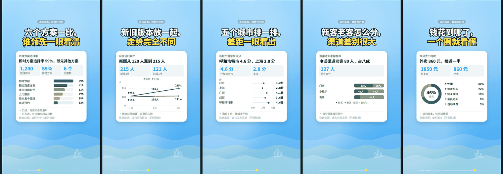

<div align="center">


# 精酿 · BrewReel

**便宜模型，也能酿出好片：写一份产品简报，AI 挑镜头、写文案，一条命令出一支竖版宣传片。**

[](CHANGELOG.md)
[](https://github.com/Finderchangchang/brewreel/stargazers)
[](LICENSE)
[](#在-deepseek-harness-里用)


[官网](https://brewreel.com) · [快速开始](#快速开始) · [演示视频](https://github.com/Finderchangchang/brewreel/releases/download/v0.3.0/demo-5MB.mp4) · [首次出片指南](https://brewreel.com/guides/first-promo-video.html) · [English](README.en.md)

<sub>原名 promo-video-skill / 蒸馏视频，旧地址自动跳转。</sub>

</div>

## 快速开始

需要 Node.js 18+、Python 3.10+；Windows 只支持 x64。

**1. 装依赖。**

```bash
git clone https://github.com/Finderchangchang/brewreel.git
cd brewreel/template && npm install && npx remotion browser ensure
cd .. && pip install numpy scipy imageio-ffmpeg
```

**2. 跑一个样例，确认装好了。**

```bash
node scripts/validate.mjs examples/ledger.json
node scripts/make.mjs examples/ledger.json --out ../brewreel-out/ledger
```

出片要几分钟，终端最后一行是「交付：<mp4 路径>」。`--out` 不能指向仓库里面。

**3. 让 AI 写分镜。** 把整个仓库 clone 到 `~/.claude/skills/brewreel/`（Claude Code）或 `~/.agents/skills/brewreel/`，把简报交给助手（模板见 [`brief-template.md`](brief-template.md)），让它照 `SKILL.md` 出片。不用 agent 也行：`python scripts/llm_make.py path/to/brief.md` 直接调 DeepSeek 这类 OpenAI 兼容接口。

环境变量写法、平台支持表、运行环境要求见 [安装与上手](docs/quickstart.md)。

### 在 DeepSeek Harness 里用

仓库自带 DeepSeek Harness 插件 `dsh-brewreel`，模型调插件的工具完成校验、出片和核对。需要 dsh 0.1.7-rc.2 或更高的 0.1.x：

```bash
npm install -g @deepseek-ai/dsh@0.1.7-rc.2 pnpm    # 还没装 dsh 时
dsh plugin --profile web add dsh-brewreel
dsh web
```

插件还没接真实 DeepSeek 模型实测。7 个工具、安全说明和许可提醒见 [安装与上手](docs/quickstart.md#在-deepseek-harness-里用)。

## 能做什么

<table align="center">
<tr>
<td align="center"><br/><sub><b>cards 卡片信息流</b>（默认）</sub></td>
<td align="center"><br/><sub><b>quiz 答题互动</b></sub></td>
<td align="center"><br/><sub><b>journey 角色漫游</b></sub></td>
</tr>
</table>

- **三种配方**：分镜里写 `meta.style` 选 `cards`（默认）、`quiz` 或 `journey`。能出一道选择题用 quiz，有 4–6 个类别想挨站逛一遍用 journey，其余用 cards。
- **六个行业包**：软件、餐饮、电商实物、成人职业培训、生活美容、文旅住宿，各带合规规则、推荐镜头结构和简报模板。
- **配音**：MiniMax / 阿里云 / 火山引擎三家可选，镜头时长跟着旁白走，字幕逐字点亮，配乐在人声处自动压低。
- **数据图表镜头**：条形、折线、点图、堆叠、环形 5 种，图上的数值必须能在引用的事实原文里找到，见 [`docs/shots/dataChart.md`](docs/shots/dataChart.md)。
- **18 套主题**：cards 默认 6 套，另有 12 套可选配色，不选时老分镜出片不变，见 [`styles/cards/THEMES.md`](styles/cards/THEMES.md)。
- **校验与合规**：《广告法》极限词、行业规则、断词换行、安全区、数字出处等几十条校验，自查有 ✗ 的片子不交付。
- **配乐和字幕**：配乐现场合成、卡着镜头切点，没有版权问题；字幕可选中文或英文。
- **口播配画面（实验）**：只放一段真人口播，一条命令 `node scripts/talk.mjs` 完成本地转写、挑句子、配画面。画面两种：免费的动效卡片（关键词、清单、步骤、数字、对比，字全部照抄原话），和默认最多 2 段 AI 生成画面（积木风、黏土定格、分层纸艺三种正式风格，另有手绘线稿（实验，只能占位预览）；花钱前先估价，要人审过）。本地转写用 SenseVoice 模型（FunAudioLLM / 阿里通义实验室）。见 [口播配画面](docs/broll.md)。

<p align="center"></p>
<p align="center"></p>

每项的详细说明见 [功能](docs/features.md)，六个行业和更多样例的截图见 [截图](docs/gallery.md)。

## 为什么用它

- **便宜模型只做它做得好的事。** 模型只写一份 `storyboard.json`：挑镜头、填文字，不写代码、不算坐标。版式、动效、节奏都在现成组件里。
- **配方由强模型先调好。** 每种风格先由强模型做到位，再写成组件和校验规则；便宜模型照着填，出片水准由配方兜底。
- **合规红线先拦一遍。** 报错用中文写清楚哪一镜哪个字段要改；校验 → 配乐 → 渲染 → 检查帧一条命令走完。
- **开源、可商用。** Apache-2.0，注明出处即可；渲染出的视频不要求署名。

## 文档

- [安装与上手](docs/quickstart.md)：平台支持、运行环境、完整安装、用便宜模型直接跑、DeepSeek Harness 插件
- [功能](docs/features.md)：三种配方、配音、行业包、校验与合规、调配方与原创性检查、出片质检
- [截图](docs/gallery.md)：三种配方、六个行业和更多样例的实际渲染画面
- [它怎么工作](docs/how-it-works.md)：从简报到成片的流程、目录结构
- [口播配画面](docs/broll.md)：给真人口播配动效画面和 AI 画面（实验），一条命令、转写、费用、审片
- [常见问题](docs/faq.md)：配乐、配音、Remotion 授权、Windows、ffmpeg、下载失败等
- [已知限制](docs/limitations.md)：实测分数、仍存在的问题、测试方法与各轮结果
- [首次出片指南](https://brewreel.com/guides/first-promo-video.html) · [产品简报模板](https://brewreel.com/guides/product-brief.html)（官网）
- [更新日志](CHANGELOG.md) · [历史版本](https://github.com/Finderchangchang/brewreel/releases) · [贡献说明](CONTRIBUTING.md)

## 已知限制

- **还是预览版**：目前还不建议把成片不经人工修改直接对外发布。把成片当初稿，看完整片再改再发。
- **便宜模型实测还没到「能直接发」**：最近一轮 9 支没有一支到 7 分，失分主要在跨字段的事实问题（价格条件、编出来的距离）和文案质量。
- **部分接入还没真实实测**：阿里云、火山引擎配音还没用真实 key 跑过；DeepSeek Harness 插件还没接真实 DeepSeek 模型实测。
- **没有实拍就只能插画**；不做医疗美容、处方药 / 药品、K12 学科培训、保健品功效宣称、烟草。

完整清单、测试方法和各轮结果见 [已知限制](docs/limitations.md)。

## 交流群 / 需求收集

**如需联系，请公众号私信。** 合作、赞助、反馈都走公众号私信。暂时还没有精酿 · BrewReel 的专属交流群。

<p align="center"></p>

**问题反馈走 [GitHub Issues](https://github.com/Finderchangchang/brewreel/issues)**：误伤或漏拦的校验规则、渲染出错、看着别扭的画面，附上分镜 JSON 和报错最好（别贴 API Key）。

想听真实需求：你想给什么产品做片？缺哪种配方、哪个行业？哪条合规规则误伤了你？公众号私信或开 issue 都行。

## 姊妹项目

同一作者放在 [jev-chat](https://github.com/jev-chat) 组织下的开源项目：

- [Jev 聊天助手](https://github.com/jev-chat/jev-chat-jarvis)：装在手机上的「对话副驾」，在受支持的聊天 App 里帮你读懂对方、给出回复建议并填入输入框，发不发由你。
- [Jev 聊天助手 macOS 版](https://github.com/jev-chat/jev-chat-jarvis-mac)：微信消息意图识别悬浮窗，看屏 + 本地小模型判断意图和风险，再按话术生成回复候选，纯只读。
- [Jev 聊天助手 Windows 版](https://github.com/jev-chat/jev-chat-windows)：微信 Windows 4.x 旁挂的回复辅助，窗口截图 + 本地离线 OCR，3 条候选一键填入，发送永远手动。

## 版权与许可

Copyright © 2026 Finderchangchang。代码以 [Apache-2.0](LICENSE) 协议开源，另见 [NOTICE](NOTICE) 和 [THIRD_PARTY_LICENSES.md](THIRD_PARTY_LICENSES.md)。

- **可以商用**：个人和公司都可以使用、修改、再分发，或集成进自己的产品，不需要付费或事先授权。
- **必须注明出处**：按 Apache-2.0 第 4 条，分发本项目、它的修改版或包含它的产品时，保留 LICENSE，并把 NOTICE 里的署名放进你的 NOTICE 文件、说明文档或产品界面。推荐写法：`基于 精酿 BrewReel（https://github.com/Finderchangchang/brewreel）二次开发`。
- 不要用「精酿」「BrewReel」名称或 brewreel.com 域名暗示由原作者出品或背书。
- **渲染出的视频不要求署名。**
- **Remotion 不是开源软件**：4 人及以上的营利组织需要购买 Remotion 的 Company License，本仓库的 Apache-2.0 不改变这一点，详见 <https://www.remotion.dev/license>。
- 字体 Noto Sans SC、Cascadia Mono 使用 SIL Open Font License 1.1，许可证全文随字体文件放在 `template/public/fonts/`。

**使用边界**：`industries/` 和校验脚本里的规则整理自公开法规和平台规则，只用于辅助自查，**不构成法律意见**，也不保证覆盖所有平台的最新规则。内容是否合规，以监管部门和平台当时的最新规定为准，责任由发布者自行承担。

## ❤️赞助商

> 想出现在这里？加微信 **jskjkf007**，添加时请备注「BrewReel 商务合作」。

## ☕ 请我喝杯咖啡

如果精酿帮你省下了一晚上剪片的时间，欢迎请我喝杯咖啡。每一份配方都是一杯杯咖啡熬出来的：这杯续上，下一份配方就调得快一点；哪天仓库里突然多了一个新风格，多半是这杯起了作用 😄

<p align="center">
  
</p>

<p align="center"><sub>量力而行，不用有压力；点个 Star、提个 issue，或者给我看看你酿的片子，我一样开心。</sub></p>

## 致谢

- 口播配画面的思路来自 [erduo1998-cell/vidmuse-video-creator](https://github.com/erduo1998-cell/vidmuse-video-creator)（抖音「耳朵」）：「读字幕、挑哪几句配解释画面」的方法参考了它，代码是重写的。
- 本地转写用 [SenseVoice](https://github.com/FunAudioLLM/SenseVoice)（FunAudioLLM / 阿里通义实验室），由 [sherpa-onnx](https://github.com/k2-fsa/sherpa-onnx) 运行。
- 视频合成基于 [Remotion](https://www.remotion.dev/)。
- 各自的许可见 [THIRD_PARTY_LICENSES.md](THIRD_PARTY_LICENSES.md)。
