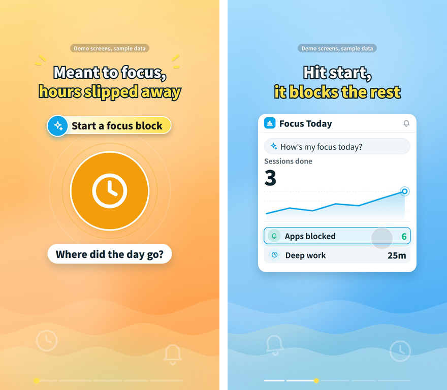
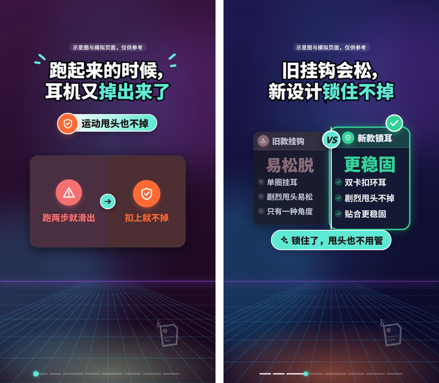
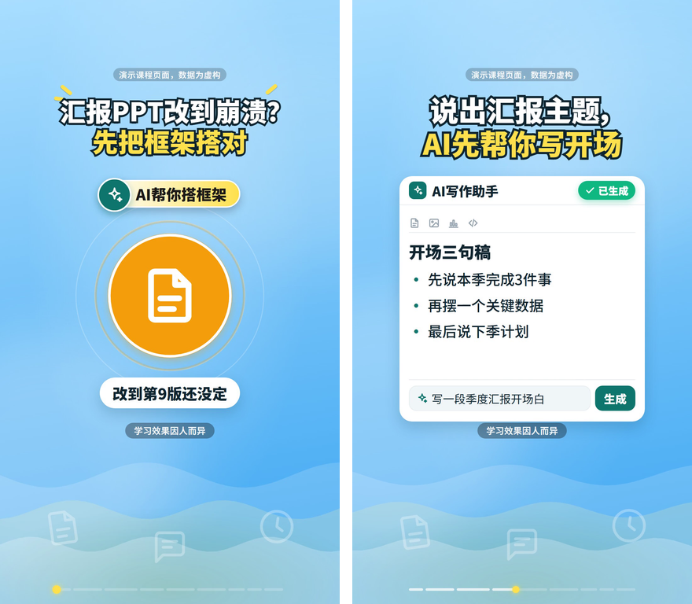
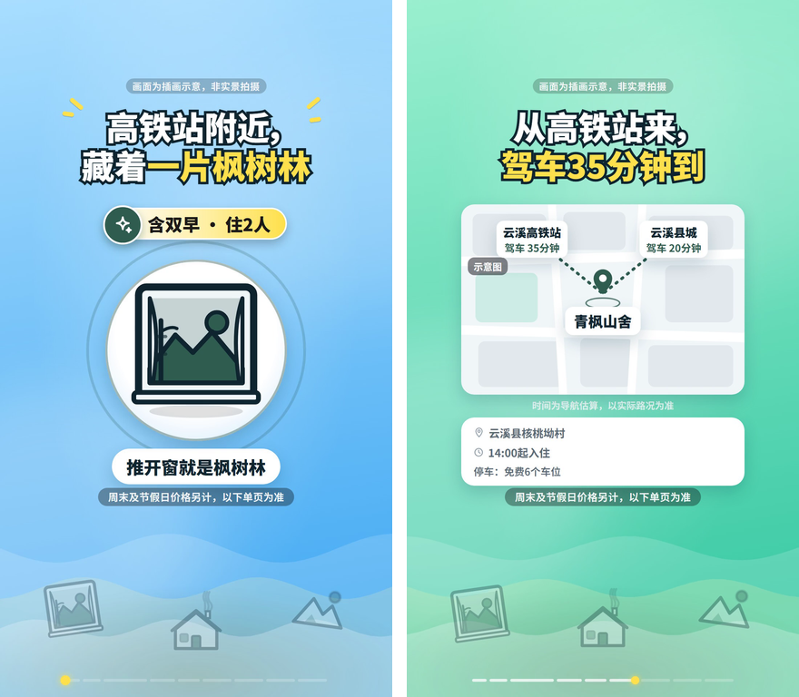

# promo-video-skill

[English version → README.en.md](README.en.md)

作者：**柳伟杰**（GitHub [@Finderchangchang](https://github.com/Finderchangchang)）。转载、二次开发或商用请保留 `LICENSE` 与 `NOTICE` 并注明出处。

> **早期预览版**：测试和修复仍在进行中，欢迎提 issue 反馈误伤规则、渲染问题和体验建议。

一句话：给 AI 编程助手（Claude Code / Codex / opencode…）用的 skill，把「写分镜 → 出竖版宣传短片」这件事标准化——便宜模型只写一份 `storyboard.json`，固定的 Remotion 组件负责画面，校验脚本拦硬性规则和行业合规红线，一条命令出片（1080×1920，带原创配乐和音效）。

## 30 秒看懂

1. 你（或 AI）把商家简报整理成 `storyboard.json`（挑镜头、填文字，不写代码、不写坐标）。
2. `node scripts/validate.mjs storyboard.json` 校验：硬性规则和《广告法》/行业合规红线会被拦下并给出中文报告。
3. `node scripts/make.mjs storyboard.json --out <目录>` 一条命令出片：配乐 → 渲染 → 拼图 → 检查帧，全自动。

## 效果示例

每张图左边是第 0 帧封面，右边是片中一帧；分镜都在 `examples/` 里，产品和数据都是虚构的，每份都能直接通过校验并用 `make.mjs` 出片。

| 软件 · 情感聊天（jev） | 软件 · 记账工具（ledger） | 软件 · 会议纪要（meeting） |
| --- | --- | --- |
|  |  |  |
| **英文字幕（en-focus）** | **餐饮上新（food）** | **电商实物（ecommerce）** |
|  |  |  |
| **教培课程（education）** | **美业，无实拍照片（beauty）** | **文旅住宿（travel）** |
|  |  |  |

## 能做什么、不做什么

**能做**：软件产品、餐饮、电商实物、成人职业培训、美业（生活美容）、文旅住宿六个行业的竖版宣传短片；中文或英文字幕；11 个通用镜头 + 7 个行业镜头（实拍/价目表/门店卡/评价/前后对比/参数表/资历卡）；内置广告法极限词、行业合规红线、断词换行、安全区等几十条自动校验。

**不做**（这些品类校验规则里没有覆盖，硬要做也不保证合规）：
- 医疗美容、处方药/药品、K12 学科培训、保健品功效宣称、烟草
- 不生成"看起来像真实拍摄"的拟真实物图片——没有真实素材时，画面会用简笔插画兜底并明确标注，不冒充实拍

## 支持的行业与语言

| `meta.industry` | 说明 |
| --- | --- |
| `software`（默认） | App / SaaS / 工具类产品 |
| `food` | 餐饮、门店、单品上新 |
| `ecommerce` | 电商实物商品 |
| `education` | 成人职业培训（不含 K12） |
| `beauty` | 生活美容（不含医美） |
| `travel` | 文旅、住宿、民宿 |

`meta.lang`：`zh`（默认，中文字幕）/ `en`（英文字幕）。

## 安装

### 环境要求

| 项目 | 要求 |
| --- | --- |
| Node.js | ≥ 18（建议 20 LTS 或更高；本仓库在 Node 22 上测试过） |
| Python | 3.10+（配乐脚本用，`numpy`/`scipy`） |
| 操作系统 | Windows（仅 x64）/ macOS ≥ 15 / Linux（glibc ≥ 2.35，需要 `libnss3`/`libgbm`/`libasound2` 等共享库；不支持 Alpine、nixOS） |

### 三条命令

```bash
git clone https://github.com/Finderchangchang/promo-video-skill.git
cd promo-video-skill/template && npm install && npx remotion browser ensure
cd .. && node scripts/validate.mjs examples/ledger.json
```

第一条命令下载渲染引擎依赖（含 7 个平台的 Remotion compositor，选装但保留在 lock 文件里方便切平台）；第二条会额外下载一次 Chrome Headless Shell（约 110MB，供无头渲染用）；第三条跑一遍自带的示例分镜，校验通过就说明装好了。

也可以作为 skill 装进你的 AI 编程助手（如果它支持 skill 管理器）：手动把整个仓库 clone 到 `~/.claude/skills/promo-video-skill/`（Claude Code）或 `~/.agents/skills/promo-video-skill/`（通用约定），或用你工具自带的 skill 安装命令指向本仓库地址。

## 工作流

```
简报（brief）
  → 分镜 storyboard.json（挑镜头、填文字）
  → node scripts/validate.mjs（硬性规则 + 行业合规，报告拦下要改的地方）
  → node scripts/make.mjs（配乐 → 渲染 → 拼图 → 检查帧）
  → 发布前人工自查清单（SKILL.md 的「发布前自查清单」一节）
```

详细流程和每个字段的用法看 `SKILL.md`（AI 助手照着这份文档写分镜）；`shots.md` 是 18 个镜头的参数总表；`docs/shots/*.md` 是每个镜头的详细文档。

## 用便宜模型跑（DeepSeek 示例）

`scripts/llm_make.py` 是一个不需要 agent、直接调 OpenAI 兼容接口的无头脚本：简报进、视频出，校验报错会自动回喂给模型重试。

```bash
export ANTHROPIC_BASE_URL=https://api.deepseek.com/anthropic   # 仅当把 DeepSeek 接到 Claude Code 时需要
export ANTHROPIC_AUTH_TOKEN=<你的 DeepSeek API Key>
export ANTHROPIC_MODEL=deepseek-flash[1m]

# 或者直接用无头脚本，不接 Claude Code：
export LLM_API_KEY=<你的 DeepSeek API Key>
export LLM_BASE_URL=https://api.deepseek.com
export LLM_MODEL=deepseek-chat
python scripts/llm_make.py path/to/brief.md
```

Windows PowerShell 用 `$env:LLM_API_KEY="..."` 代替 `export`。以上环境变量只是占位符示例，请替换成你自己的 key；不要把 key 提交进仓库或写进 issue。也可以把这些变量写进 AI 编程助手自己的全局配置（如 `~/.claude/settings.json`），但这是可选做法，本仓库不会替你改任何全局配置。

## 行业包：怎么新增一个行业

每个行业是 `industries/<id>/` 下的一套文件：

```
industries/<id>/
  rules.json           合规规则（enabledShots、checks、mediaPolicy 等，和 industries/_base/rules.json 合并）
  recipe.md             推荐的镜头结构、写作要点（AI 助手写分镜前必读）
  recipe.en.md           英文版
  brief-template.md      给商家的简报模板
  brief-template.en.md   英文版
  test-brief.md          一份完整测试简报
  expected.md            这份测试简报应该触发哪些规则（回归测试用）
```

新增行业：复制一份现有行业目录改名，参照 `industries/_base/rules.json` 的字段说明填 `rules.json`，写 `recipe.md` 说清楚这个行业该用哪些镜头、常见合规红线，再写一份 `test-brief.md` + `expected.md` 跑 `node scripts/test-rules.mjs` 验证规则生效。

## 校验规则说明和免责声明

`scripts/validate.mjs` 里的规则整理自公开的《广告法》极限词清单和各平台公开规则，分三档：
- **错误（block）**：必须改，否则 `make.mjs` 拒绝出片
- **警告（warn）**：建议改，不强制拦截
- **人工复核（human）**：机器判断不了（比如"照片是否真的授权""评价是否真实"），出片后列成清单给发布者自己确认

**这些规则只是辅助自查，不构成法律意见，也不保证覆盖所有平台的最新规则。** 内容是否合规，以监管部门和平台当时的最新规定为准，责任由发布者自行承担。已知的规则边界和未核实事项见 `docs/dev/`（本仓库不含开发笔记目录本身，欢迎在 issue 里反馈你实测到的误伤或漏拦）。

## 测试状态 / 已知限制

这是早期预览版，**目前还不建议把成片不经人工修改直接对外发布**。

**测试方法**：前几轮用 DeepSeek 级别的便宜模型批量写分镜。最近一轮（本版发布前）换成 Claude Haiku 级别的小模型扮演「便宜模型」：只给它简报和 `SKILL.md`，让它从零写分镜、跑校验、出片，共 9 支。其中软件 / 工具类 4 支（聊天辅助 App、公众号文章发布工具、数据问答类工具、英文字幕的专注计时器），行业片 5 支（餐饮、电商、教培、美业、文旅各一支）。全程**没有商家实拍照片**，画面靠组件和插画兜底。成片由人逐帧看，按 10 分制给「整体」和「合规」两项打分，并逐条核对分镜和简报。

**这一轮的结果**：9 支里没有一支达到 7 分（我们定的「可以直接发」的线）。
- 软件 / 工具类：整体 5–6 分，合规 7–8 分。功能演示最完整的一支是 6 分：聊天 → 分析 → 候选回复 → 填入。
- 行业片：整体 4–5 分，合规 4–5 分。失分主要在跨字段的事实问题上，见下面第 1、3 条。
- 上一轮的硬伤这轮基本没再出现：英文片画面里没有汉字（94 个抽查帧），速度类说法被拦住，同一张图不能再当前后对比，价目表组件不再漏画条目，路线标注带上了目的地，版式自查有 ✗ 的片子会被拒绝交付。
- 交付：9 支里模型自己交出成片的有 5 支。2 支在渲染排队时模型就提前结束了，1 支渲染到一半被中断，1 支被 `make.mjs` 的一个 bug 挡住（传了 `--brief` 时误把文件路径当简报原文，导致数字全部报「简报里找不到」）。这个 bug 在本版已修；本版还加了两条：`--out` 指向仓库内部时 make 直接拒绝，`SKILL.md` 要求模型看到「交付：」那一行才能收工。

**仍存在的主要限制**（欢迎在 issue 里补充实测反例）：

1. **价格条件可以靠删 facts 绕过去**：价格条件、日期范围、加价项的检查，只对模型自己写进 `meta.facts` 的内容生效。模型把 facts 删掉，画面上的价格就没人核对了。实测中丢过节假日价和加价金额、活动日期、有效期、一项加价服务。传 `--brief` 可以核对「facts 是否出自简报」，但核对不了「简报里的价格条件有没有上屏」。
2. **组件会悄悄丢数据**：比如 mockApp 的 dashboard 只显示放得下的行，不支持的 `done` 字段直接不显示，校验不报。
3. **位置和插画的真实性**：「步行几分钟」这类说法仍会被模型编出来，门店卡会自动加一行「导航估算」。插画配上「本店作品」、插画和标签对不上（例如山景图标成「卫浴间」）、把真实数据标成示例数据，这些校验还拦不全。
4. **模板感**：不同片子的封面、默认折线图、片尾白卡、底部装饰经常一样，只换了字和颜色。
5. **文案质量没有自动检查**：截断的半个词、别扭句子、英文语法和句首大小写、同一片里卖点重复三遍、前后说法矛盾（如「三步」和「一步」），都没有自动检查。不带数字的夸大词（如「翻倍」「都说好」）也拦不住。
6. **核心动作不强制演示**：工具类产品「点开始」这样的核心动作，可能被演成一个不相关的界面，校验不管。
7. **版式**：深色主题上品牌色数字的对比度可能不够。内容少时部分面板下半截留白。照片标注互相压住要等渲染完才被拦，白等几分钟。priceCard 塞满时整体缩到 0.8 倍，个别小字会低于 26px。
8. **英文和素材检查的覆盖面**：行业合规词表按中文写，英文文案查得没有中文全。素材只能在文件层面查（同图、改名复制、截图当实拍）；是不是同一位顾客、有没有授权，只能列进「需人工复核」。

**建议用法**：
- 把成片当初稿用：看完整片，改掉别扭的文案和重复的卖点再发。不要只看校验通过就发。
- 行业片尽量配商家实拍照片（门店、成品、价目），出片时传 `--brief <简报>`。交付前把画面上每个价格、条件、日期、营业时间、距离逐条和简报对一遍。
- 测试产物用 `--round` 放在仓库外，不要写进仓库。

## 目录结构

```
promo-video-skill/
  SKILL.md / SKILL.en.md      AI 助手看的说明书（怎么挑镜头、写字段、走流程）
  README.md / README.en.md    人看的项目说明（本文件）
  LICENSE / NOTICE / THIRD_PARTY_LICENSES.md
  shots.md / shots.en.md      18 个镜头的参数总表
  brief-template.md           通用简报模板
  docs/
    shots/                    每个镜头的详细文档（18 × 2 语言）
    images/                   README 里的效果示例图
  industries/                 六个行业包（见上一节）
  scripts/
    validate.mjs              校验入口
    make.mjs                  一条命令出片
    llm_make.py                无头模式：简报 → 分镜 → 出片
    make_bgm.py                 参数化原创配乐
    build_docs.mjs              从 spec.json 生成 shots.md / shots.en.md
    privacy-scan.mjs            发布前隐私自查
    checks/ lib/                 校验规则的实现
  template/                   Remotion 渲染工程
    src/shots/                 18 个镜头组件 + 参数 spec
    src/core/                  字体、主题、动画、版式等公共逻辑
    src/illust/                行业插画兜底
    public/                    字体、音效、示例素材
  examples/                   9 份可直接渲染的分镜样例（六行业 + 英文 + 两份通用示例）
  tests/
    validate/                  校验规则的正负例回归测试
    rules/                     六个行业的规则回归测试（各 4 例）
```

## FAQ

**Remotion 5.0 发布后升级要注意什么？**
本仓库把 `remotion` / `@remotion/cli` 钉在 `4.0.529`。升级到 5.0 后，Remotion 免费层需要在配置里传 `licenseKey`（个人/3 人以下公司/非营利填 `"free-license"`），详见 [Remotion 许可证页](https://www.remotion.dev/license)。升级前请先看 `THIRD_PARTY_LICENSES.md`。

**`npm install` 后 lock 文件里缺某个平台的 compositor 怎么办？**
`package-lock.json` 里应该有 7 个 `@remotion/compositor-*` 平台包（win32-x64-msvc / darwin-arm64 / darwin-x64 / linux-x64-gnu / linux-x64-musl / linux-arm64-gnu / linux-arm64-musl）。如果你的平台对应的条目缺失，删掉 `template/node_modules` 和 `template/package-lock.json` 后在目标平台上重新 `npm install`（这是 npm 已知的可选依赖解析问题，跨平台生成的 lock 文件不一定包含所有平台）。

**Chrome Headless Shell 下载失败怎么办？**
国内网络环境下 `npx remotion browser ensure` 可能连不上 Google 的下载地址。可以手动下载后用 `--browser-executable` 指定本地 Chrome/Chromium 路径（不同 Chrome 版本渲染结果可能有细微差异）。

**Windows 下 `--props` 报「neither valid JSON」？**
Windows shell 会吃掉 JSON 字符串里的引号，所以分镜一律用文件路径传入（`--props=./storyboard.json`），不要直接在命令行拼 JSON 字符串。本仓库的 `make.mjs`/`llm_make.py` 已经是文件传入方式。

**需要装系统 ffmpeg 吗？**
不需要。拼图 `sheet.png` 由 Remotion 的 `Sheet` 合成直接出图（整片每秒一帧，缩略排成网格，每格下面标时间和镜号），检查帧 `check/*.png` 用 Remotion 自带的 ffmpeg 从成片里抽，抽不出来会改用 Remotion 单帧补。设了环境变量 `FFMPEG=/path/to/ffmpeg` 时，拼图会先用它的 `tile` 滤镜拼，失败再退回 `Sheet` 合成。拼图没生成不影响成片 `video.mp4`，终端会打印原因。

## 许可证

本仓库代码以 **Apache-2.0** 许可证发布，见 `LICENSE`，版权人：柳伟杰（Finderchangchang）。**可以免费商用**；按 Apache-2.0 第 4 条，转载、修改后再发布或集成进你的产品时，必须保留 `LICENSE`，并在你的 NOTICE 文件、文档或产品界面里保留 `NOTICE` 中的署名（即注明出处：基于柳伟杰的 promo-video-skill）。用本工具渲染出的视频不要求署名。

本仓库依赖 [Remotion](https://www.remotion.dev) 作为渲染引擎——Remotion 是**源码可见、非开源**的软件：个人、3 人及以下的营利公司、非营利组织可免费使用（含商用）；**4 人及以上的营利组织需要购买 Remotion 的 Company License**，详见 <https://www.remotion.dev/license>。本仓库的 Apache-2.0 许可证不改变 Remotion 自己的许可条件，具体见 `THIRD_PARTY_LICENSES.md`。

字体 Noto Sans SC、Cascadia Mono 使用 SIL Open Font License 1.1，许可证全文随字体文件放在 `template/public/fonts/`。

用本项目渲染出的视频，不要求为本项目署名。
