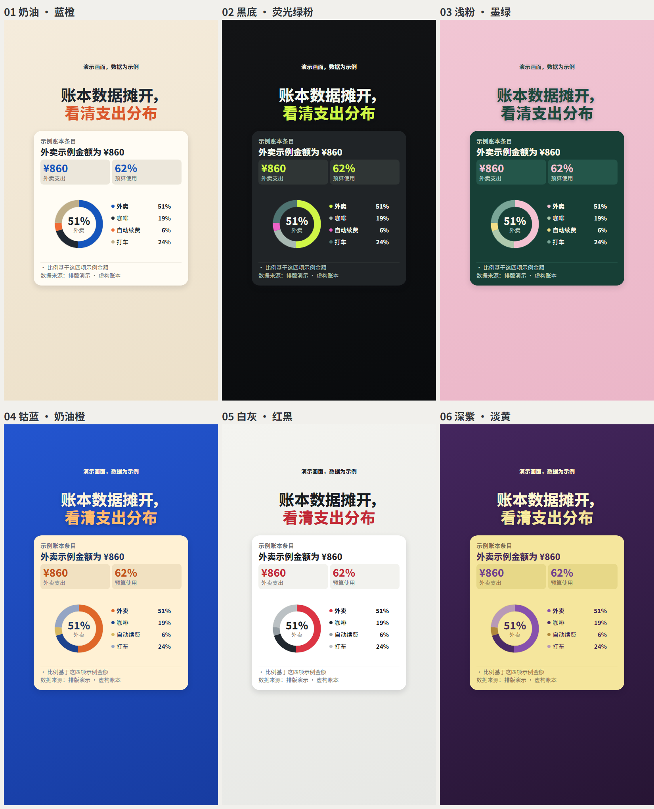
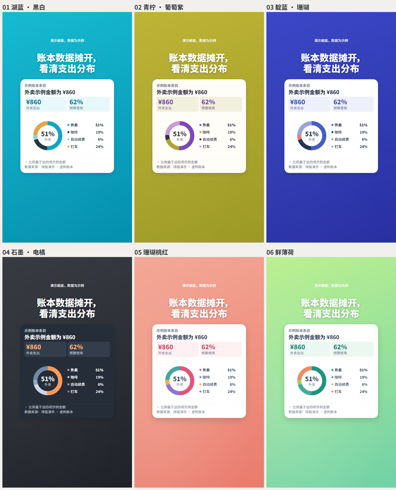
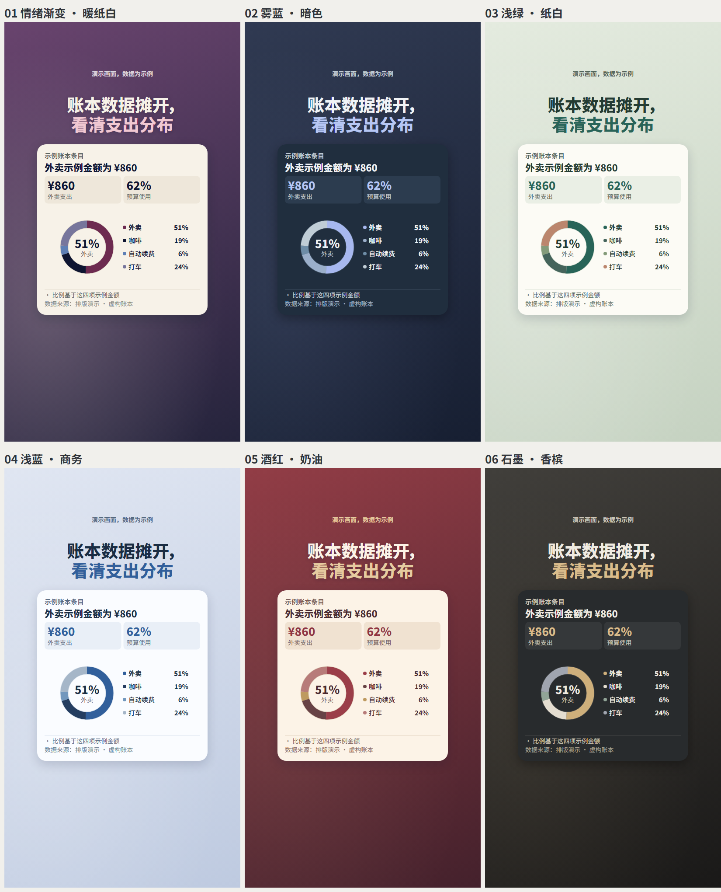
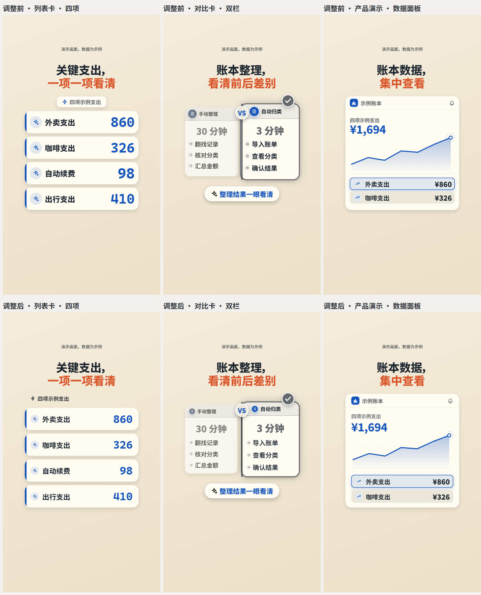
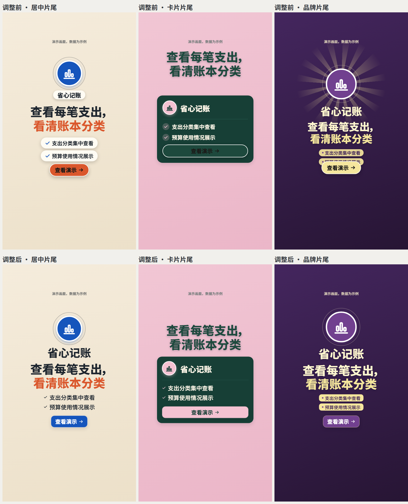
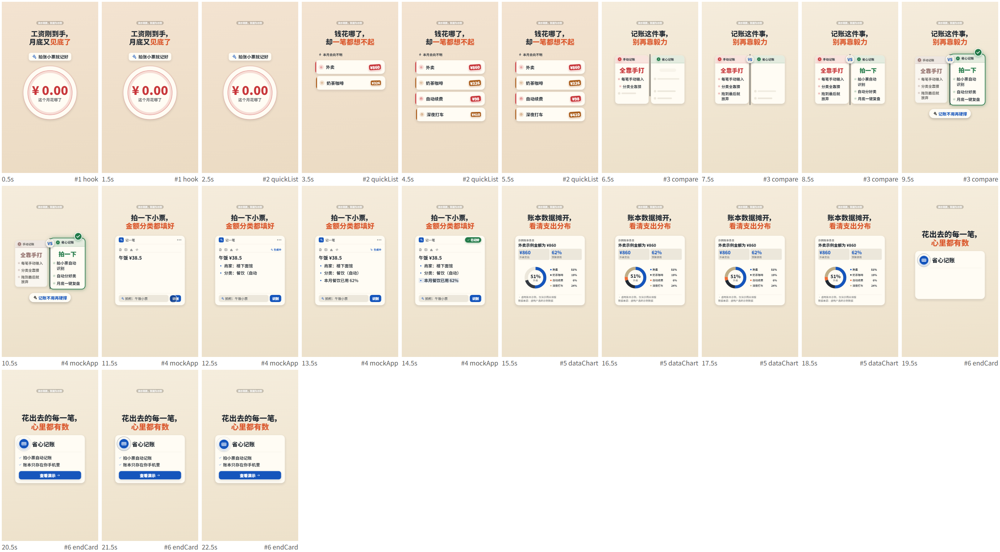
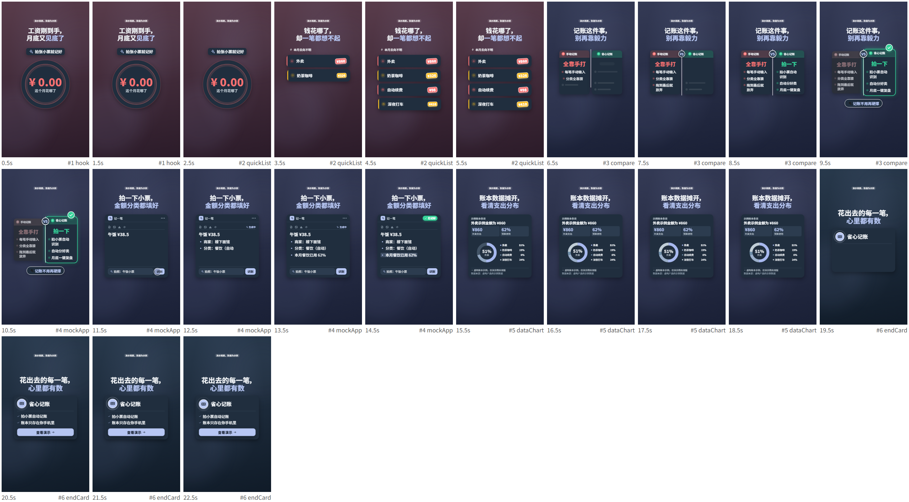

# Cards visual refresh · review notes

This change updates the default `cards` style. The `quiz` and `journey` designs retain their original palettes and components.

## Scope

- Curate 18 theme presets, including the six original IDs; preserve mood gradients, semantic good/warn/bad colors, and brand accent overrides.
- Use theme-specific caption treatments and chart series colors.
- Add `dataChart` with bar, line, dot, stacked, and donut charts, takeaway, KPIs, annotations and source references. Extend specs, validation and six industry registries.
- Increase card text readability and establish shared spacing for quick lists, comparisons and mock interfaces.
- Refine hook badges and three end-card layouts while preserving large headline sizes and content capacity.
- Remove decorative light sweeps; use a 0.32-second fade and 12px rise for verdict and end-card CTA entrances.
- Fix Windows render-lock cleanup and ensure stale-lock retry paths respect polling and queue timeout.

## Theme previews

## Layout comparisons

Top row: previous layout. Bottom row: revised layout.

## Full storyboard previews

Two 23-second sample renders were generated locally without voiceover. Each passed the built-in checks for text wrapping, seven layout probe frames and all 690 frames for blank-screen detection. The sample copy produces 23 non-blocking similarity warnings because it intentionally reuses the ledger example for design comparison. These renders exercise six shot types and two palettes; they do not verify every theme, chart variant or shot combination. No additional test suite was run.

The author should review the palette roles, chart API and data-source checks, card scale, and end-card timing before merging. Videos are kept outside the repository; the images here show the generated frames. Theme details: [theme catalog](../styles/cards/THEMES.md), [palette notes](../styles/cards/STUDIO_PALETTES.md).
